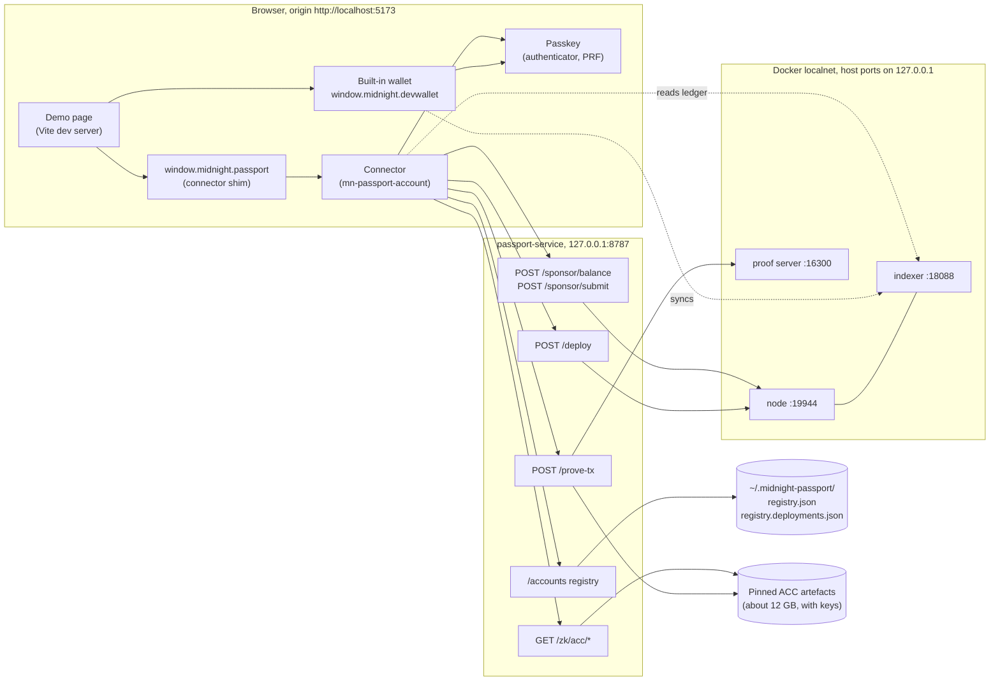

# Midnight Passport DApp prototype

This is a working prototype of the Passport **account API** and the web app that carries its heavy
lifting. The prototype called the account API the "DApp Connector API"; every operation in it is the
account owner's, so it is now the account API v1 (ADR 0007, D-8), and the dApp-facing connection is
the later grant ceremony. It serves Lace epic LW-15579 (the Passport smart account as the Lace account model)
and unblocks LW-15635 (a passkey Passport account) **on the standalone network**.

A new user creates a passkey. The prototype deploys a Passport account (the ACC) for it, pays the
fees, installs the passkey as the first device and confirms one transaction signed by the passkey.
After a page reload the same passkey reopens the same account. A built-in wallet, derived from the
same passkey, is connected through the Midnight DApp Connector API.

The account API v1 is versioned in `mn-passport-protocol` (`1.0.0-pre.0`); the prototype's
`0.1.0-prototype` shapes remain as deprecated `…Prototype` types behind `createPassportConnector`. The design is in
[`docs/superpowers/specs/2026-10-06-passport-dapp-design.md`](../superpowers/specs/2026-10-06-passport-dapp-design.md).
This folder describes what the code does today.

## What works today

Everything below ran on the Passport localnet, network id `undeployed`, against the pinned
artefacts (binding `acc-45721e1`).

| Capability                                                                              | Evidence                                                                                            |
| --------------------------------------------------------------------------------------- | --------------------------------------------------------------------------------------------------- |
| Create an account: passkey, 10-wave deploy, sponsored activation                        | Deploy 180 s, activation 24 s, about 3 min 24 s in all (X8: 179.6 s and 24.0 s; X9: 180 s and 24 s) |
| Rotate the encryption key with a passkey signature, proved on the service and sponsored | About 1 min per rotation (X8: 72 s and 53 s; X9: the proof itself took 22.5 s)                      |
| Reopen the account with the same passkey after a reload, checked against the chain      | Under a second once the passkey answers (X8: 38 ms for the checks)                                  |
| Rotate again after the reopen, which rescans the use counter                            | Confirmed, authorisation nonce 2 (X8, X9, X9a)                                                      |
| Connect the built-in wallet, derived from the passkey, over DApp Connector API 4.1.0    | Connected and synced against the indexer from the page (X9, X9a)                                    |
| Refuse a passkey provider without PRF before anything is deployed                       | Seen in X9 with the "Chrome profile" store                                                          |
| The whole flow with a software authenticator, without a browser                         | X8 passed in 329 s: create, rotate, reopen, rotate                                                  |
| The whole flow in a browser with a mock passkey                                         | X9a                                                                                                 |
| The whole flow in Chrome on macOS with a platform passkey that has PRF                  | X9                                                                                                  |

The run records are in `experiments/acc-0.35/results/`:
[`x8-dapp-e2e.json`](../../experiments/acc-0.35/results/x8-dapp-e2e.json),
[`x9-dapp-mock-run.md`](../../experiments/acc-0.35/results/x9-dapp-mock-run.md) and
[`x9-dapp-manual-run.md`](../../experiments/acc-0.35/results/x9-dapp-manual-run.md).

The longest wait is the deploy. The ACC does not fit in one block, so the service deploys it in 10
waves. The demo asks for the maintenance authority to be retired (`retireAuthority: true`), which
the last wave does, so a deployed account can never be upgraded. The account API makes the caller
choose; there is no default.

What does not work, or is not built, is in [limitations.md](./limitations.md). The main points: the
registry is an off-chain file, the testnet is not wired, and the service has no authentication.

## Components

- **The page** (`apps/passport-dapp`) injects the connector at `window.midnight.passport`, as a
  wallet would, and drives it by its buttons. It also hosts the built-in wallet.
- **The connector** (`packages/account`) holds the flows: create, open and rotate. It reaches the
  passkey, the chain and the registry only through injected seams.
- **The browser adapter** (`packages/adapter-browser`) supplies those seams: WebAuthn, the Lace key
  recipe, the clients for the service, and midnight-js 5 for building and submitting calls.
- **The service** (`apps/passport-service`) serves the ZK artefacts, proves transactions, deploys
  accounts, sponsors fees and keeps the registry. It holds the only funded key.
- **The localnet** (`infra/localnet`) is a node, an indexer and a proof server in Docker. The
  service talks to all three. The page talks to the indexer only.

## Processes and ports

| Port  | Process                       | Why this port                                                                                                                                                      |
| ----- | ----------------------------- | ------------------------------------------------------------------------------------------------------------------------------------------------------------------ |
| 5173  | The demo page (Vite)          | Fixed, with `strictPort`. The ACC's WebAuthn profile `wa-json134` binds a 21-byte origin, and `http://localhost:5173` is exactly 21 bytes. Open it as `localhost`. |
| 8787  | `passport-service`            | The service's default (`PASSPORT_SERVICE_PORT`). The page expects it unless `VITE_PASSPORT_SERVICE_URL` says otherwise. Bound to `127.0.0.1`.                      |
| 19944 | Node (container 9944)         | Host port of the Passport localnet. It differs from the Midnight default 9944.                                                                                     |
| 18088 | Indexer (container 8088)      | As above. The Midnight default is 8088.                                                                                                                            |
| 16300 | Proof server (container 6300) | As above. The Midnight default is 6300.                                                                                                                            |

The localnet ports are non-default so that the stack runs beside another Midnight localnet on the
same machine. Inside the Docker network the containers keep their standard ports. On macOS the
compose override publishes the host ports on `127.0.0.1` only. They are set in
[`infra/localnet/ports.env`](../../infra/localnet/ports.env), which `scripts/prototype-up.sh`, the
compose override and the service all read. `experiments/acc-0.35/patch-endpoints.sh` rewrites the
reference client's hard-coded 9944, 8088 and 6300 to follow the same file.

`pnpm prototype:up` checks that all five ports are free and exits, naming the occupant, if one is
not. It never stops anything for you.

## Where state lives

| State                                           | Where                                            | Notes                                                                                                                                       |
| ----------------------------------------------- | ------------------------------------------------ | ------------------------------------------------------------------------------------------------------------------------------------------- |
| The account: devices, nonce, encryption key     | The chain (the localnet's Docker volumes)        | The authority. `prototype:up` stops the containers and keeps the volumes, so accounts survive a restart.                                    |
| Passkey to account mapping                      | `~/.midnight-passport/registry.json`             | Written by the service. Keyed `<networkId>/<credentialId>`. An untrusted hint: the connector checks it against the chain before it uses it. |
| Accounts this service deployed                  | `~/.midnight-passport/registry.deployments.json` | Beside the registry. The sponsor funds calls only to accounts that are in both files.                                                       |
| The passkey's private key                       | The authenticator                                | It never leaves it.                                                                                                                         |
| Wallet seed, account encryption key, PRF output | Nowhere                                          | Derived on demand and zeroed. See [keys.md](./keys.md).                                                                                     |
| Browser storage                                 | None                                             | The one exception is the dev-only mock passkey, which keeps its keys in `localStorage` (`passport-dev:mock-passkey:v1`).                    |
| The evidence panel                              | The page, in memory                              | Lost on reload. Use "Copy evidence" first.                                                                                                  |

`PASSPORT_REGISTRY_FILE` moves the registry. The deployed set follows it. The files are kept outside
the repository so that accounts can be reopened later. After a chain reset, delete both. See
[demo.md](./demo.md#troubleshooting).

## The other documents

- [demo.md](./demo.md): the demo script for a presenter, mock mode, passkey provider advice and
  troubleshooting.
- [flows.md](./flows.md): a sequence diagram for each flow, with the endpoints, circuits and seams.
- [keys.md](./keys.md): how the wallet seed and the account's encryption key derive from the
  passkey.
- [limitations.md](./limitations.md): what the prototype does not do, and what production needs.
- [`apps/README.md`](../../apps/README.md): setup, environment variables, how to run the stack, and
  operational troubleshooting. This folder does not repeat it.
