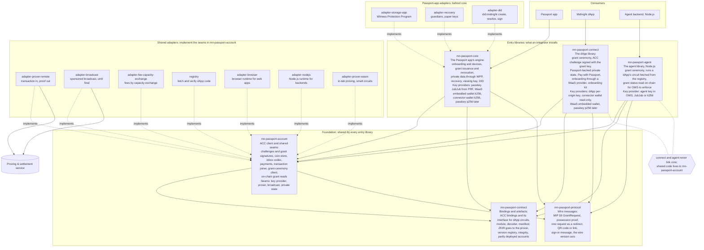
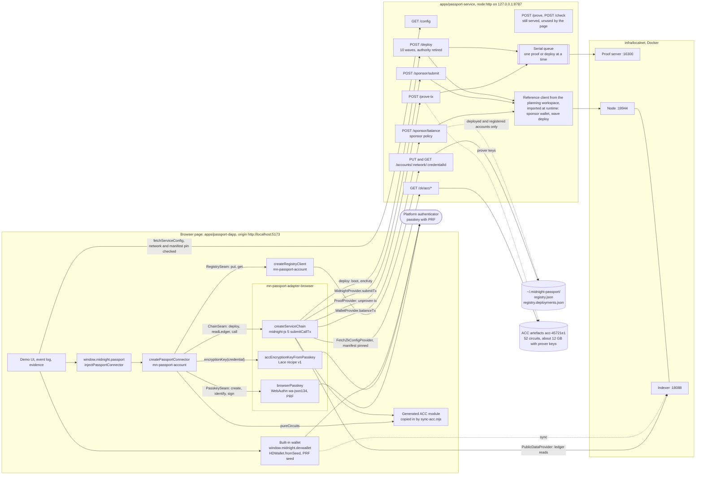
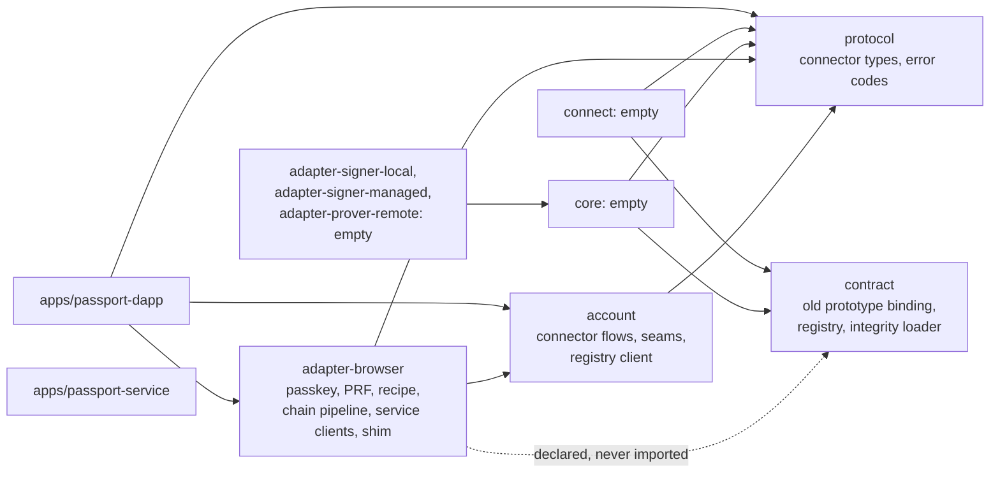

# Architecture: intended against built

This page compares what the Passport DApp prototype built with the architecture the SDK is heading
for, and with the Passport module in [lace-platform](https://github.com/input-output-hk/lace-platform),
its first production consumer. It is the input to the publishing design in
[`docs/superpowers/specs/2026-10-07-passport-sdk-packages-design.md`](../superpowers/specs/2026-10-07-passport-sdk-packages-design.md).

Sources, read on 2026/10/07:

- **Intended.** The SDK realignment proposal (2026-09-25) and the proposal's package map; this
  repository's [`architecture.md`](../architecture.md), [`dapp-connection.md`](../dapp-connection.md),
  [`provider-integration.md`](../provider-integration.md),
  [`onboarding-and-key-authorisation.md`](../onboarding-and-key-authorisation.md) and
  [`adr/`](../adr/).
- **Built.** The code on `passport-acc-prototype` at `dc5f38d`: `packages/{protocol,account,adapter-browser,contract}`,
  `apps/passport-service`, `apps/passport-dapp`, the
  [prototype spec](../superpowers/specs/2026-10-06-passport-dapp-design.md), the
  [plan](../superpowers/plans/2026-10-06-passport-dapp-prototype.md),
  [`scripts/dependency-graph.mjs`](../../scripts/dependency-graph.mjs) and
  [`scripts/lint-boundaries.mjs`](../../scripts/lint-boundaries.mjs).
- **lace-platform** `main` at `5c8022c7a`: `packages/module/passport-account`,
  `packages/contract/passport`, `packages/lib/passkey`, ADRs 14, 19, 28, 30, 39, 41 and 51, and
  PRs [#2713](https://github.com/input-output-hk/lace-platform/pull/2713),
  [#2732](https://github.com/input-output-hk/lace-platform/pull/2732),
  [#2738](https://github.com/input-output-hk/lace-platform/pull/2738),
  [#2770](https://github.com/input-output-hk/lace-platform/pull/2770),
  [#2784](https://github.com/input-output-hk/lace-platform/pull/2784) and
  [#2805](https://github.com/input-output-hk/lace-platform/pull/2805).

The other pages in this folder describe the prototype itself: [README](./README.md),
[flows](./flows.md), [keys](./keys.md) and [limitations](./limitations.md).

## 1. Intended architecture

The proposal's package map has three tiers: entry libraries that an integrator installs, a
foundation they all share, and adapters. Shared adapters implement seams declared in
`mn-passport-account`, so a dApp or an agent never reaches `core`. Adapters that only the Passport
app needs sit behind `core`. The map draws "all depend on the foundation"; the edges inside the
foundation below are read from the proposal's text, not from the picture.

What the proposal changes against this repository's `architecture.md`, in short: the C23 dApp
connector is retired in favour of the MIP §9 grant ceremony; one key-provider interface replaces the
five signer and wallet adapters; the prover becomes "transaction in, proof out"; settlement becomes
broadcast through a sponsor, with no user-held DUST; and `mn-passport-account` is a new foundation
package, so `connect` and `agent` stay free of `core`.

## 2. Built architecture

### 2.1 Runtime components

The prototype is one browser page, one Node service and a Docker localnet. The connector logic is
platform-neutral and reaches everything through injected seams; the browser adapter fills the seams
with WebAuthn, the Lace key recipe, midnight-js 5 and HTTP clients for the service.

The edges carry the seams of `packages/account/src/seams.ts` (`PasskeySeam`, `ChainSeam`,
`RegistrySeam`, `pureCircuits`, `encryptionKey`) and the midnight-js 5 providers that
`createServiceChain` builds over the service. The page never fetches a prover key. `/prove` and
`/check` remain from an earlier design (`delegatedProvingProvider` is still exported) but nothing
calls them: midnight-js 5's ledger asks its proving provider for each circuit's prover key before it
proves, so a per-circuit remote `prove` would still need the keys in the browser (up to 495 MB for
one circuit). The whole unproven transaction goes to `/prove-tx` instead.

### 2.2 Package graph, as enforced

`scripts/dependency-graph.mjs` is the single source both enforcement layers read. Apps sit outside
it.

`core`, `connect` and the three seam adapters are scaffolding (`export {};`). `account` is
platform-neutral by rule: no `node:` imports and no globals other than `crypto`. The service imports
none of the packages; it is a `node:http` layer over the planning workspace's reference client,
loaded at runtime from `PASSPORT_CONTRACT_DIR`.

## 3. Deviations

"Deliberate" cites the ruling or reason recorded in the spec, the plan or an issue. "Converge" says
whether the prototype's choice should move towards the proposal, the proposal towards the
prototype, or both towards something new; the publishing design turns each into a package or port.

| #   | Item                                  | The proposal intended                                                                                                                                                                                                                                                                                                                    | The prototype built                                                                                                                                                                                                                                                                                                                                                                                                                                                                                      | Deliberate or accidental                                                                                                                                                                                                                                                                                         | Converge, and how                                                                                                                                                                                                                                                                                                                                                                                                                                                              |
| --- | ------------------------------------- | ---------------------------------------------------------------------------------------------------------------------------------------------------------------------------------------------------------------------------------------------------------------------------------------------------------------------------------------- | -------------------------------------------------------------------------------------------------------------------------------------------------------------------------------------------------------------------------------------------------------------------------------------------------------------------------------------------------------------------------------------------------------------------------------------------------------------------------------------------------------- | ---------------------------------------------------------------------------------------------------------------------------------------------------------------------------------------------------------------------------------------------------------------------------------------------------------------- | ------------------------------------------------------------------------------------------------------------------------------------------------------------------------------------------------------------------------------------------------------------------------------------------------------------------------------------------------------------------------------------------------------------------------------------------------------------------------------ |
| 1   | Transaction-level proving             | `adapter-prover-remote`: "transaction in, proof out", `prove(unprovenTx, circuitIds) → provenTx`, implementing a prover seam in `mn-passport-account`; proving keys stay with the prover; shared by all three entry libraries.                                                                                                           | `POST /prove-tx` takes the serialised unproven transaction and returns it proven, unbound, using the service's keys and the proof server. The client side is `serviceProofProvider`, a midnight-js `ProofProvider` inside `adapter-browser`'s chain pipeline, not a port of its own. No circuit list travels; `/prove-tx` has no circuit allow-list (only `/prove` and `/check` do), and relies on the service's key registry covering the account bundle only.                                          | **Deliberate**, and it confirms the proposal: midnight-js 5 resolves each circuit's prover key on the client before proving, and the 52-circuit ACC has 12.2 GB of prover keys with single keys up to 495 MB (spec §2, X6; comment in `service-chain.ts`). Its placement inside `adapter-browser` is accidental. | **Yes, keep the shape.** A `Prover` port with `proveTx(unprovenTx, context)` in `mn-passport-account`; `adapter-prover-remote` implements it over `/prove-tx`; the service allow-lists by the binding's circuits on `/prove-tx` too. Retire `/prove` and `/check`, or keep them only as a bridge for circuit-level provers such as lace-platform's `PassportProver` (section 4).                                                                                               |
| 2   | Sponsor and settlement                | The settlement seam becomes **broadcast**, in `mn-passport-account`: `adapter-broadcast` hands the proven transaction to the sponsor, which pays the fees and broadcasts it, then tracks it until it is final with bounded waits and resubmission. No user-held DUST; `adapter-fee-capacity-exchange` is the other way to pay.           | Two calls: `/sponsor/balance` returns the balanced, finalised transaction to the browser, then `/sponsor/submit` hands it back for the service to submit. They are midnight-js `WalletProvider` and `MidnightProvider` implementations. Finality is watched in the browser by `submitCallTx` through the indexer. The sponsor policy (calls only, deployed and registered accounts only, fee-only, deploy cap) sits in the service's balance step.                                                       | **Deliberate**: reuse midnight-js's own wallet and submit seams (Ruling R16(a)); the policy guards the balance step because the reference wave deploy balances through the same wallet (Ruling R17).                                                                                                             | **Yes, both ways.** Two small ports, `FeeSponsor.balance` and `Submitter.submit`, match lace-platform's `FeeSponsor.balanceAndSign` and its node relay; `adapter-broadcast` implements both over HTTP and adds the bounded waits. The sponsor policy becomes an injectable rule set in the service library. The round trip of a balanced transaction through the browser can become one `/sponsor/submit` that balances and submits, once nothing client-side needs the bytes. |
| 3   | Where the deploy runs                 | Onboarding (the waved deploy, first-device activation, name claim) runs in `core`, or for a WaaS dApp in `connect` or a small onboarding library (open question 15). The client builds the deploy; the sponsor pays.                                                                                                                     | `POST /deploy` is a service job: the browser sends the boot commitment and encryption key; the service runs the reference wave deploy (10 waves within a 15,000-verifier-byte budget), generates a recovery-at-birth JubJub key and discards its secret, and retires the maintenance authority in the last wave.                                                                                                                                                                                         | **Deliberate**: deploying exceeds a block and the maintenance updates are hand-built (spec §2); retiring the authority is the recorded default (spec §4.4, open Q1).                                                                                                                                             | **Partly.** A deploy planner over the binding (FS-0.9 D-11) belongs in `mn-passport-account`; who executes it is a `Deployer` port, so the service job and a client-side deploy are both adapters. The service side stays useful for a pool of pre-deployed accounts ([#23](https://github.com/input-output-hk/midnight-passport-sdk/issues/23)). Retiring the authority becomes an explicit parameter, as lace-platform's required `lockAccount` is.                          |
| 4   | Finding the account from the passkey  | The proposal's "registry" is a different thing: content-addressed dApp code for agents. Recognising an account goes through the WaaS provider's metadata, WPP metadata or the passkey's `largeBlob`; fork issue [#20](https://github.com/input-output-hk/midnight-passport-sdk/issues/20) moves the passkey-to-account mapping on chain. | An off-chain JSON file behind `PUT` and `GET /accounts/{network}/{credentialId}`, write-once except `deployed` to `active`. It also carries the boot salt, the only way to activate a deployed account. The connector treats each record as an **untrusted hint**: the picked passkey must own the record's key, a contract must exist, and the ledger must hold the passkey's device entry.                                                                                                             | **Deliberate stand-in**: Ruling R10(b) and spec §5.3; discovery on a new device was left open (spec Q2, epic A6). Not meant to last.                                                                                                                                                                             | **Yes, towards #20.** An `AccountDirectory` port with the verification kept in `mn-passport-account`, whatever the source: the HTTP file today, an on-chain registry contract next, WaaS metadata or `largeBlob` later. Rename ours "directory" so it does not collide with the proposal's dApp-code registry.                                                                                                                                                                 |
| 5   | What `adapter-browser` holds          | `adapter-browser` is the browser runtime for web apps: passkeys with PRF, and the two WASM runtimes loaded in order. Proving and broadcast are separate shared adapters.                                                                                                                                                                 | One package holds the WebAuthn `wa-json134` passkey seam, the PRF ceremonies and the create-time PRF hold, the Lace key recipe (HKDF, BIP-39, MIP-0015, X25519), the HTTP clients and their error mapping, the midnight-js chain pipeline (proof, wallet, submit and public-data providers, `FetchZkConfigProvider` with the manifest pin, a `setNetworkId` call at construction), the unused delegated prover, and the shim.                                                                            | **Accidental.** The spec's unit table (§3.1) grouped every browser seam in one unit for speed; nothing argued for coupling the passkey to the chain pipeline. The effect is that importing the passkey also imports midnight-js statically.                                                                      | **Yes.** Split by responsibility: WebAuthn and PRF; the key recipe (platform-neutral); the midnight-js chain (loaded on demand); the service clients; and a thin browser composition root with the shim. The module-global `setNetworkId` moves to the operation, as lace-platform applies it per flow.                                                                                                                                                                        |
| 6   | Authoriser arm: P-256 against JubJub  | Key providers list "Passkey · JubJub (PRF)" as the Passport app's device, with "Passkey · p256 (later)" waiting on the contract's p256 arm.                                                                                                                                                                                              | The P-256 WebAuthn arm only (`wa-json134`, the passkey signs each call), on the 52-circuit ACC `acc-45721e1`, which has that arm. PRF output #1 is evaluated, to keep the ceremony identical to Lace's, and unused. `MvpCircuit` names only `*_with_p256` circuits. A P-256 proof takes 30 to 70 s and about 13.5 GiB on the proof server.                                                                                                                                                               | **Deliberate**: the divergence from Lace is recorded (spec §5.4). Owner direction on 2026/10/07 ([#24](https://github.com/input-output-hk/midnight-passport-sdk/issues/24)): support both, P-256 expected as the default. The proposal predates the p256 arm.                                                    | **Both arms.** An arm-agnostic `Authoriser` port, a P-256 WebAuthn implementation and a JubJub-from-PRF implementation; the account records its arm, and circuits are picked from the binding's catalogue by arm. See section 4 for the origin-length constraint that ties the P-256 arm to the page's origin.                                                                                                                                                                 |
| 7   | The built-in wallet                   | No wallet in the SDK. A Midnight connector wallet is a key provider (k256 through `signData`), registered as a device or a read-only grant; it is not something Passport hosts.                                                                                                                                                          | `apps/passport-dapp/src/wallet`: an in-page wallet built with `HDWallet.fromSeed` from the passkey's BIP-39 seed (Lace recipe v1), exposed at `window.midnight.devwallet` with a read-only subset of the DApp Connector API 4.1.0. It proves and pays nothing.                                                                                                                                                                                                                                           | **Deliberate**: MVP step 6 and spec §5.5 (a stand-in for lace-sdk's wallet; it supersedes Rulings R22 and R24). It lives in the app, not in a package.                                                                                                                                                           | **No convergence needed.** It stays a demo fixture, never published. lace-platform has no phrase-derived Midnight spending wallet in scope ([#2784](https://github.com/input-output-hk/lace-platform/pull/2784)), so nothing here should suggest one.                                                                                                                                                                                                                          |
| 8   | The connector API shape               | The C23 request/response connector is retired. Connection is the MIP §9 grant ceremony: one `GrantRequest` with a possession proof, delivered as a redirect, a QR code or a link. There is no channel through which Passport acts for a dApp. `mn-passport-protocol` carries those messages.                                             | `window.midnight.passport = { name, apiVersion, connect(networkId) }` returns `PassportConnectorAPI { createAccount, openAccount }`; a `PassportAccount` offers `state()` and `rotateEncryptionKey()`. Version `0.1.0-prototype`, eight error codes, five coarse `onProgress` steps. It is an account owner's API, injected the way a wallet connector is.                                                                                                                                               | **Deliberate** for the prototype's goal, a connector lace-sdk can consume (spec §1, Q3), but **not reconciled** with the proposal: the spec calls it a "DApp Connector API" while its operations are the Passport app's (create, open, device calls).                                                            | **Rename and re-home.** It is the account API that a wallet host such as Lace offers its user, the surface the proposal gives `core`; the dApp-facing connection remains the grant ceremony, later. Keep the descriptor as one optional transport, version the API (section 3 of the design) and keep it in `mn-passport-protocol`.                                                                                                                                            |
| 9   | What `mn-passport-contract` holds     | "Bindings · artefacts": the ACC's bindings and its interface for dApp circuits; the module, ledger decoder and manifest, with ZKIR for the prover only; the version registry; integrity; acceptance of partly deployed accounts. About 1 MB per contract on the client (decision 6).                                                     | The package still carries the old prototype binding `0.0.0-prototype.1` (Compact runtime 0.16.0, three witnesses, a two-argument constructor), its registry and the integrity loader. The prototype does not use it: the generated module of `acc-45721e1` is copied into the page by `sync-acc.mjs`, the manifest pin is an environment variable baked in by Vite, and the service reads the whole 12 GB directory from `PASSPORT_CONTRACT_DIR`. `account` re-declares the pure-circuit types it needs. | **Deliberate deferral** (spec §1.2: refactoring onto the 0.35.0 binding is FS-0.9 T1 to T3). The unused `adapter-browser` → `contract` dependency is accidental.                                                                                                                                                 | **Yes, through FS-0.9.** One package with the generated module and types, contract info, the compiler manifest, ZKIR and verifier keys, no prover keys (0.28 MB packed, 2.88 MB unpacked for the 36-circuit build in X2; 15 of the 52-circuit keys exceed GitHub Packages' 256 MB limit on their own). The runtime becomes an exact peer dependency, which also removes the copy step (section 4).                                                                             |
| 10  | Network configuration                 | The platform seam (FS-0.8) is kept: network and ceremony primitives supplied by the host.                                                                                                                                                                                                                                                | The network id is fixed at `undeployed`. The browser takes the indexer, node and artefact URLs from the service's `/config`; the service refuses any endpoint other than the ones the reference client hard-codes.                                                                                                                                                                                                                                                                                       | **Accidental limitation**: the reference client hard-codes the localnet, and endpoints from `/config` are not pinned (final review M6). No fork issue is filed yet; [limitations](./limitations.md) records it.                                                                                                  | **Yes.** A `NetworkConfig` value passed in by the host, as lace-platform's `PassportNetworkConfig` is (network id and URLs), plus the binding id and manifest hash, all fixed at build time. `/config` becomes a convenience that is checked, never trusted.                                                                                                                                                                                                                   |
| 11  | Progress                              | The command pipeline emits an event per stage, proof provenance included (this repository's architecture §4.3); the proposal adds nothing more.                                                                                                                                                                                          | `onProgress` reports five coarse steps for create only. The demo times its own client-side stages; nothing reports inside the 180 s deploy or the proof queue.                                                                                                                                                                                                                                                                                                                                           | **Known gap**, [#17](https://github.com/input-output-hk/midnight-passport-sdk/issues/17).                                                                                                                                                                                                                        | **Yes.** A typed, platform-neutral event in `mn-passport-protocol`, emitted by every flow; the service reports per-wave and queue progress through a job that the client polls.                                                                                                                                                                                                                                                                                                |
| 12  | Encrypting the preimage to an enclave | This repository's `CLAUDE.md` MUST: encrypt the proof preimage to the enclave before remote proving. The proposal changes it: V1's prover receives the transaction and sees the coin and the amount, and the user is told.                                                                                                               | The unproven transaction travels in clear to `/prove-tx`; the service's TLS is a production requirement.                                                                                                                                                                                                                                                                                                                                                                                                 | **Deliberate**: no enclave prover exists; aligned with the proposal, not with the current MUST.                                                                                                                                                                                                                  | **Proposal wins.** Amend the MUST through `doc-sync` with an ADR; the `Prover` port carries a `disclosure` field so a UI can tell the user where the proof ran.                                                                                                                                                                                                                                                                                                                |
| 13  | Where secrets live                    | This repository's architecture §4.1: a small kernel in `core` is the only code that holds decrypted secrets, under the ceremony gate.                                                                                                                                                                                                    | There is no kernel. The passkey's private key never leaves the authenticator; PRF outputs, the BIP-39 seed and the encryption secret exist briefly inside `adapter-browser` (a module-private `WeakMap` for create-time PRF, zeroed after one use or 60 s) and inside the page's wallet code.                                                                                                                                                                                                            | **Deliberate** for the MVP: no ceremony-gated witness exists yet, because the P-256 arm signs in the authenticator.                                                                                                                                                                                              | **Converge on the key source as the boundary**, as lace-platform does: secrets stay in a key-source adapter that hands out only named derivations, public keys and signatures. The "kernel" becomes that boundary plus, later, the `held_coin` witness in `core`.                                                                                                                                                                                                              |

## 4. Alignment with lace-platform

lace-platform's Passport support is a module, `@lace-module/passport-account`, over a contract
package, `@lace-contract/passport`, and a library, `@lace-lib/passkey`. Its flows are plain async
functions behind injected seams; the module wraps them in observables for its store, and its README
says the flow layer "could move upstream unchanged". That is the same shape as this prototype's
`createPassportConnector(seams)`, which is what makes a shared package realistic.

### 4.1 Seam by seam

| This prototype                                                                  | lace-platform                                                                                                                                                                                                                                                   | Where they meet, and where they differ                                                                                                                                                                                                                                                                                                                                                                                                        |
| ------------------------------------------------------------------------------- | --------------------------------------------------------------------------------------------------------------------------------------------------------------------------------------------------------------------------------------------------------------- | --------------------------------------------------------------------------------------------------------------------------------------------------------------------------------------------------------------------------------------------------------------------------------------------------------------------------------------------------------------------------------------------------------------------------------------------- |
| `PasskeySeam` (`create`, `identify`, `sign(credential, challenge)`), P-256 only | `PassportAuthoriser` (`scheme: 'jubjub-schnorr'`, `devicePublicKey`, `deviceCommitment(s)`, `authorise(request)`, optional `storageKey`, optional `withKeySession`)                                                                                             | Both are one-device authorisers. Ours receives a finished challenge, computed by the connector from the binding's pure circuits; Lace's receives the circuit, arguments, nonce and counter and builds the challenge itself, which lets a remote signer refuse a request outside the flow it approved. Ours has `identify()` with `owns()` for discovery; Lace has `withKeySession` to keep one prompt per flow.                               |
| PRF handling inside `adapter-browser` (`passkeyPrf`, create-time hold, pinning) | `PasskeyKeySource` in `@lace-lib/passkey` (`ensureCredential`, `withSession`, `deviceSecret`, `recordKey`, `deriveSecret`, `withPasskeyMnemonic`); a remote variant on a Lace signer page ([#2805](https://github.com/input-output-hk/lace-platform/pull/2805)) | Same recipe v1: salts `lace-passport/prf/authoriser/v1` and `lace/prf/root/v1`, HKDF wallet entropy, BIP-39, MIP-0015 at `lace-passport:acc-enc:v1`, context `<networkId>/0`. Our tests reproduce Lace's vectors. Lace's key source is the cleaner boundary: the root never leaves it.                                                                                                                                                        |
| `encryptionKey(credential)`                                                     | `PassportEncryptionKey.publicKey(networkId)`                                                                                                                                                                                                                    | Same output, the X25519 public key the contract stores as `enc_key`. Lace also compares it with the ledger at sign-in (`encryption-key-mismatch`); we do not yet.                                                                                                                                                                                                                                                                             |
| `ChainSeam.call` over `/prove-tx`, `/sponsor/balance`, `/sponsor/submit`        | `PassportProver` (`prove(preimage, keyLocation)`, `check`), `FeeSponsor.balanceAndSign`, and the module's own node relay and indexer clients                                                                                                                    | Lace's prover is **circuit-level**: its HTTP prover downloads each circuit's prover key, verifier key and ZKIR from `artefactUrl` to the client and posts them to a proof server. That works for the circuits it proves today and is impractical in a browser for the 52-circuit ACC, whose single keys reach 495 MB. `FeeSponsor.balanceAndSign` matches our `/sponsor/balance` exactly; Lace submits itself, we submit through the service. |
| `ChainSeam.deploy` over `/deploy`                                               | Deploy in the module, through the sponsor, with a required `lockAccount`                                                                                                                                                                                        | Lace deploys client-side and lets the caller choose whether to retire the authority; we deploy on the service and always retire it.                                                                                                                                                                                                                                                                                                           |
| `RegistrySeam` (remote, per credential, untrusted, carries the salt)            | `AccountRecords` (local, `read`, `write`, `exists`), sealed with AES-GCM under the record key                                                                                                                                                                   | Different jobs. Lace's is this device's memory of its account; ours is cross-device discovery. Both are needed, as two ports. Lace has no discovery on a new device (its A6).                                                                                                                                                                                                                                                                 |
| Endpoints from `/config`, network fixed                                         | `PassportNetworkConfig { networkId, indexerUrl, indexerWsUrl, nodeUrl, artefactUrl }`, supplied by the host                                                                                                                                                     | Lace's shape is the right one; we add the binding id and the manifest hash.                                                                                                                                                                                                                                                                                                                                                                   |
| `CreateAccountStep`: five steps                                                 | `FlowStage`: `deploying`, `proving`, `sponsoring`, `activating`; `ceremony`, `ready` and `error` derived by the host                                                                                                                                            | Both coarse. The #17 event model is a superset that maps onto both.                                                                                                                                                                                                                                                                                                                                                                           |
| Eight PascalCase codes (`UserCancelled`, `AccountNotFound`, …)                  | Kebab-case codes on error classes (`ceremony-cancelled`, `prf-unsupported`, `account-not-found`, `account-contract-missing`, `encryption-key-mismatch`, `not-authorised`, `device-entry-not-found`, `sponsor-exhausted`, …)                                     | Lace's set is finer and closer to what a user is told. The design maps one onto the other.                                                                                                                                                                                                                                                                                                                                                    |

### 4.2 Where they differ beyond the seams

- **Different contract builds.** Lace vendors an earlier ACC: JubJub and an interim ECDSA arm, no
  recovery commitment, a two-argument constructor, Compact runtime `0.18.0-rc.1`, midnight-js
  `5.0.0-beta.4`. The prototype uses `acc-45721e1`: 52 circuits with the P-256 arm, a five-argument
  constructor with recovery at birth, runtime `0.20.0`, midnight-js `5.0.0-rc.2`. An account created
  by one cannot be opened by the other until both use one binding.
- **The P-256 arm is tied to the page's origin.** The `wa-json134` profile requires a 134-byte
  `clientDataJSON` and a 21-byte origin, which is why the prototype runs at exactly
  `http://localhost:5173`. Lace's hosted relying party, `https://passkey.lace.io`, is 23 bytes, so
  the P-256 arm cannot sign from it under this profile. The JubJub arm has no origin binding. This
  matters for the default arm (#24) and is an open question in the design.
- **Use counters.** Lace stores an anchor and scans a window of 4,096 counters in chunks, upwards
  then below; the prototype scans 0 to 63 from zero on every call.
- **Bundling.** Lace keeps every Midnight package external and reachable only through dynamic
  `import()` from the passport chunks, enforced by a scan of the SDK's build output (ADR 30). It
  dedupes the Midnight packages with Vite's `resolve.dedupe`. The prototype met the same two-copies
  failure (two `compact-runtime` instances) and fixed it by copying the generated module into the
  app; the package design replaces the copy with a peer dependency.
- **Module isolation.** Lace modules never import other modules (ADR 14) and swappable SDKs live in
  provider packages behind ports (ADR 39). External libraries are allowed, so `mn-passport-*`
  packages fit as libraries that `@lace-module/passport-account` imports.
- **Long-running work.** Lace's rule for host work that outlives one call is a request that answers
  a handle, then a poll (ADRs 41 and 51). The same pattern suits the deploy and the proof queue.
