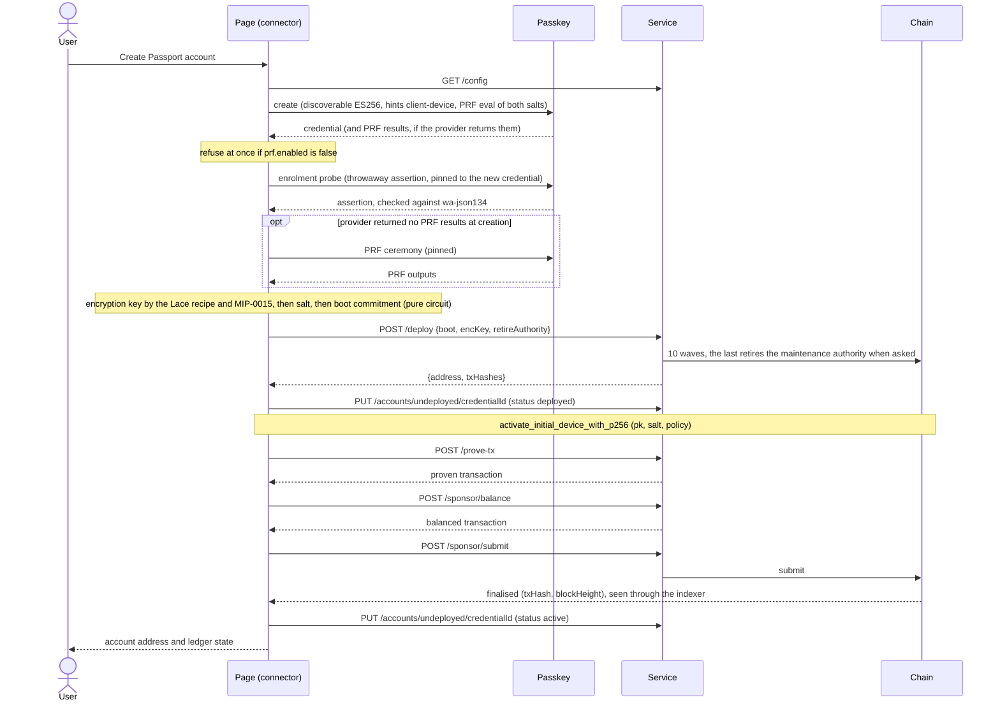
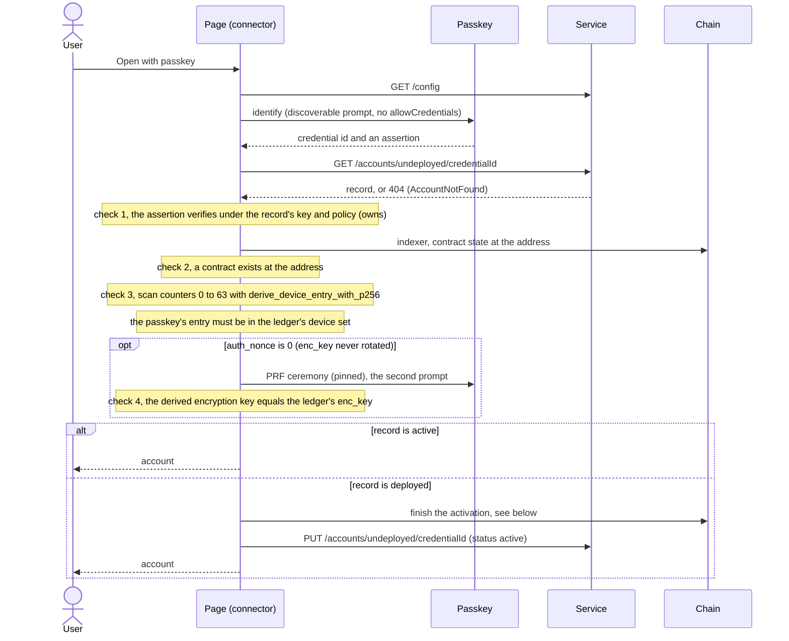
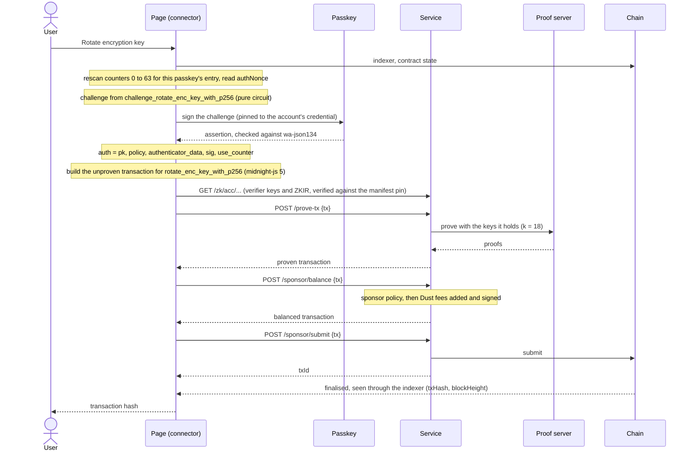
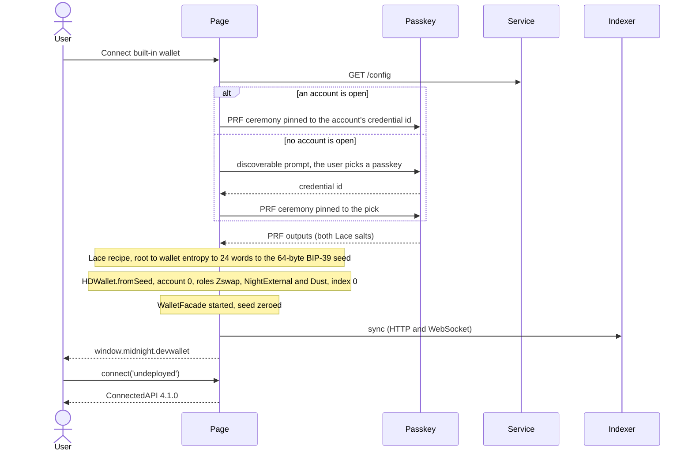
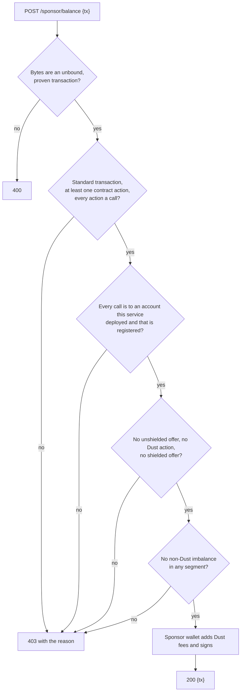

# Flows

One sequence diagram for each flow, with the endpoints, circuits and seams involved. The code is the
reference: `packages/account/src/connector.ts` holds the flows of the account API (which the
prototype called the "DApp Connector API"), `packages/adapter-browser/src` the seams, and
`apps/passport-service/src` the service.

Terms used below:

- **The page** is the demo page with the connector. **The service** is `passport-service`.
- **The chain** is the localnet node and indexer. The page reads it through the indexer. The
  service writes to it through the node.
- **A seam** is an interface the connector is handed: the passkey (`PasskeySeam`), the chain
  (`ChainSeam`), the registry (`RegistrySeam`), the pure circuits (`AccPureCircuits`), randomness
  and the encryption key.
- **The pure circuits** are the contract's own functions that run in JavaScript, with no proof:
  `derive_boot_commitment_with_p256`, `derive_device_entry_with_p256` and
  `challenge_rotate_enc_key_with_p256`.

Every service request is JSON over HTTP. Binary values are lowercase hex. The page sends
`content-type: application/json` on every `POST` and `PUT`.

## Connecting

Both create and open begin with `connect('undeployed')`, which calls `GET /config`. The connector
refuses a service on another network (`NetworkMismatch`). It also checks the service's
`manifestSha256` against the hash the page was built with, and refuses a mismatch
(`ArtefactIntegrity`). The page never takes that hash from the service. `/config` also gives the
indexer, node and artefact URLs, and the sponsor wallet's public keys.

## Create

1. **Passkey create** (`browserPasskey().create`). It makes a discoverable ES256 credential for the
   relying party `localhost`, with `hints: ['client-device']` and the PRF extension carrying both
   Lace salts. If the provider reports `prf.enabled === false`, creation is refused with
   `UnsupportedAuthenticator`, before the probe and before any deploy. A provider that says nothing
   about `enabled` is not refused here.
2. **Enrolment probe.** One assertion, pinned to the new credential (`allowCredentials`), proves the
   authenticator produces the exact `wa-json134` material: 37-byte authenticator data, flags UP and
   UV, no extensions, the 21-byte origin and ES256. PRF output adds extension data that this
   material forbids, so PRF can never share the probe or a signature.
3. **Encryption key.** The `encryptionKey` seam derives the account's X25519 `enc_key` from the
   passkey's PRF root, through the Lace recipe and MIP-0015 ([keys.md](./keys.md)). When the
   provider returned PRF results at creation they are used once and zeroed. Otherwise the seam runs
   a pinned PRF ceremony, the third prompt. A passkey that returns no PRF output fails here with
   `UnsupportedAuthenticator`, still before the deploy.
4. **Boot commitment.** The connector draws a 32-byte `salt` and computes
   `derive_boot_commitment_with_p256(salt, pk, policy)` with the pure circuit.
5. **`POST /deploy`** with `{ boot, encKey, retireAuthority }` (32 bytes each, and a boolean the
   caller must give: `createAccount` has no default for it). The service fills the constructor's
   other arguments (a fresh JubJub recovery key whose secret it discards, a zero wrap and a 3-day
   veto window) and runs the reference client's `deployAccountInWaves` with the caller's
   `retireAuthority`. That is 10 waves inside the 15,000-verifier-byte budget. The demo passes
   `true`: once the last wave retires the maintenance authority, the account can never be upgraded.
   With `false` the authority's key stays with the service's sponsor wallet. The answer is `{ address, txHashes }`
   after about 180 seconds. The `txHashes` are the waves' submission ids, not the hashes of the
   transactions as included. The service then records the address as deployed.
6. **Registry write, `deployed`.** `PUT /accounts/undeployed/{credentialId}` with the credential id,
   address, public key, policy, `salt` and `status: "deployed"`. This happens before activation,
   because the salt is the only way to activate the account. The write is idempotent, so the
   connector retries it up to three times with backoff, then fails with `InternalError`.
7. **Activation.** The connector calls `activate_initial_device_with_p256(pk, salt, policy)` on the
   new address through the chain seam (midnight-js 5's `submitCallTx`). The call takes no
   signature and proves in 2.9 s on the proof server (k = 14). The path is the one described under
   [the passkey-signed call](#the-passkey-signed-call-rotate): `/prove-tx`, `/sponsor/balance`,
   `/sponsor/submit`, then finalisation. About 25 seconds end to end.
8. **Registry write, `active`.** The same `PUT` with `status: "active"`. The service accepts only
   this transition, and only with every other field unchanged. If step 7 or 8 fails, the `deployed`
   record lets **Open with passkey** finish the job.

**Progress.** Every flow reports progress events through `onEvent` (design §3.4): a `start`, then
one `end` or `error` with the same id, for each step. Create reports `passkey.create`,
`passkey.prf`, `deploy`, `directory.write`, `activate` and `directory.write`; inside the activation
the chain adapter reports `prove`, `sponsor.balance`, `sponsor.submit` and `chain.finality`. The
deploy is one step until the service reports its waves (`deploy.wave`,
[#17](https://github.com/input-output-hk/midnight-passport-sdk/issues/17), tranche T17), so the
page's bar still fills the deploy against its 3-minute estimate. An error names the step that
failed (`step`) and whether a retry can succeed (`retryable`). The deprecated `onProgress` still
reports its five steps, `passkey-created`, `deploying`, `deployed`, `activating` and `active`,
derived from the events.

**Abort.** A `signal` that aborts ends the flow with `Aborted` at the next step. A registry write
that records what the chain already holds still runs, so an aborted create still records the
deployed account and its salt.

## Open

1. **Identify** (`browserPasskey().identify`). A discoverable `get` with no `allowCredentials`, so
   the browser shows its picker. The assertion is kept in memory, so no second prompt is needed.
2. **Registry `GET`** `/accounts/undeployed/{credentialId}`. A `404` is `AccountNotFound`. The
   registry is only a hint. The record is used only if all three checks pass; any failure is
   `AccountNotFound`.
3. **Check 1, owns.** The record's credential id is the one picked, and `identity.owns(publicKey,
policy)` is true: the identify assertion verifies under the record's key and policy. A record
   that names another account and that account's key fails here.
4. **Check 2, the contract exists.** `chain.readLedger(address)` queries the contract state through
   the indexer. No state is `AccountNotFound`.
5. **Check 3, the device entry is on the ledger.** For an `active` record, or a `deployed` record
   whose ledger is already booted, the connector scans counters 0 to 63. For each it computes
   `derive_device_entry_with_p256(self, pk, policy, deviceEpoch, counter)` and tests membership in the
   ledger's device set. No hit is `AccountNotFound`.
6. **Check 4, the encryption key.** While the ledger's `auth_nonce` is 0, the connector derives the
   account's encryption key from the passkey (a pinned PRF ceremony, the second prompt) and
   compares it with the ledger's `enc_key`; a difference is `EncryptionKeyMismatch`. Only the
   gated `rotate_enc_key_with_*` circuits change `enc_key`, and each advances `auth_nonce`, so after
   any gated call the key may have been rotated (to a random key, in the prototype) and the check is
   skipped: one prompt. It is skipped too for a `spec_version` other than 2.
7. **Finishing a `deployed` record.** The record says activation may not have landed.
   - If the ledger is already **booted** and holds the passkey, activation landed and only the
     answer or the registry write was lost. The connector adopts it: it writes `active` and does
     not activate again.
   - If the ledger is **not booted**, the connector submits `activate_initial_device_with_p256`
     with the record's salt. The boot commitment binds the public key, salt and policy on the
     chain, so a mismatched record cannot activate someone else's account. It rescans for the entry
     afterwards, and only then writes `active`.

The checks trust the indexer that `/config` names. They defend against a stale or poisoned registry,
not against a lying indexer. See [limitations.md](./limitations.md).

## The passkey-signed call (rotate)

`rotateEncryptionKey(newKey, { onEvent })` is the one passkey-authorised call of the prototype. It
reports `chain.read`, `counter.scan` and `passkey.sign`, then the chain adapter's `prove`,
`sponsor.balance`, `sponsor.submit` and `chain.finality`. The activation
call and every later call use the same pipeline.

1. **Use-counter rescan.** The page keeps no state between reloads, so it reads the ledger and
   scans counters 0 to 63 for the entry of this passkey (`derive_device_entry_with_p256`). It also
   reads `auth_nonce`. No entry is `AccountNotFound` ("This passkey has no live entry on the
   account.").
2. **Challenge.** `challenge_rotate_enc_key_with_p256(self, pk, newKey, authNonce)` runs in the
   page as a pure circuit and gives the 32-byte challenge.
3. **Passkey signature.** The `sign` seam asks the authenticator for an assertion over the
   challenge, pinned to the account's credential id. Another credential fails with "This is not the
   passkey this account was created with; choose that passkey." The assertion is checked against
   `wa-json134` before use.
4. **The call.** The connector calls `rotate_enc_key_with_p256(newKey, auth)`, where `auth` holds the
   public key, policy, authenticator data, signature and `use_counter`. midnight-js 5's
   `submitCallTx` builds the unproven transaction, using the verifier keys and ZKIR it fetches from
   `GET /zk/acc/...` and verifies against the manifest pin.
5. **Proving, `POST /prove-tx`.** The page sends the whole unproven transaction. The service
   deserialises it, proves it against the proof server with the keys it holds, and returns the
   proven transaction. A P-256 proof is k = 18, needs about 13.5 GiB, and ran in 22.5 s in the real
   passkey run. Jobs run one at a time, in a queue shared with `/deploy`. A queue of more than eight
   waiting jobs is refused with `503`.
6. **Balancing, `POST /sponsor/balance`.** The service checks the sponsor policy (below), then the
   sponsor wallet adds Dust fees and signs.
7. **Submitting, `POST /sponsor/submit`.** The service submits the balanced transaction to the node
   and answers `{ txId }`. The id identifies the submission. The connector then waits until the
   indexer reports the transaction finalised, and returns its `txHash` and `blockHeight`.

**Why proving is transaction-level.** midnight-js 5's ledger asks its proving provider for each
circuit's key material through `lookupKey`, the prover key included, before it proves. A
per-circuit remote `prove` is therefore not enough. The page would have to fetch every prover key,
up to 495 MB each, and the keys total 12.2 GB. So the page sends the whole transaction to
`/prove-tx`, and the keys stay on the service's disk. Earlier code proved one circuit at a time
through `/prove` and `/check`. Those endpoints are still served, and the adapter still exports a
`delegatedProvingProvider` for them, but the connector does not use them.

## Built-in wallet

1. **PRF ceremony.** With an account open, it is pinned to the account's credential id
   (`PassportAccount.credentialId`): one prompt, no picker. With none open, the user first picks a
   passkey from the discoverable prompt, then confirms the PRF evaluation pinned to that pick: two
   prompts. A different credential answering a pinned prompt fails with `AccountNotFound` ("This is
   not the passkey this account was created with; choose that passkey."). No PRF output fails with
   `UnsupportedAuthenticator`. There is **no fallback seed**: the wallet never opens a different,
   empty wallet, and the page never holds the sponsor's seed.
2. **Lace recipe.** The root (PRF output #2) goes through HKDF to the wallet entropy, then to 24
   BIP-39 words, then to the 64-byte BIP-39 seed. See [keys.md](./keys.md).
3. **`HDWallet`.** `HDWallet.fromSeed(seed)`, then `selectAccount(0)`, the roles `Zswap`,
   `NightExternal` and `Dust`, and `deriveKeysAt(0)`. The HD wallet is cleared once the keys exist.
4. **Facade and sync.** The page builds a `WalletFacade` with a shielded wallet and a Dust wallet
   from their seeds, and an unshielded wallet from a Schnorr keystore. It starts against the
   indexer's HTTP and WebSocket endpoints and the node's relay URL, all from `/config`. The sync runs
   in the page, so the indexer must accept the page's origin; it did in X9 and X9a. The seed is
   zeroed after the wallet starts.
5. **The surface.** The wallet is injected at `window.midnight.devwallet` as `Built-in dev wallet`
   (rdns `io.iohk.passport.devwallet`, API version `4.1.0`). `connect(networkId)` returns the connected
   API for `undeployed` and throws `InvalidRequest` for any other network. The connected API has
   `getConfiguration`, `getConnectionStatus`, `getShieldedAddresses`, `getUnshieldedAddress`,
   `getDustAddress`, `getUnshieldedBalances` and `getDustBalance`. Balance reads wait for a synced
   state, and fail after 120 seconds.
6. **Read-only.** The wallet never proves or pays. Its proving-server URL is a placeholder that is
   never contacted. The Passport flows do not depend on it, because the service sponsors the fees.

## The service's sponsor policy

`POST /sponsor/balance` balances only a narrow kind of transaction. The policy lives in the
service's balance step (`apps/passport-service/src/sponsor-policy.ts`), not around the wallet
provider, because the reference wave deploy balances its own transactions through that provider.

The rules:

- **Calls only.** A standard transaction, not a rewards claim, with at least one contract action.
  Every action is a call. Deploy and maintenance actions are refused.
- **Accounts this service deployed.** Each call targets an address that is both registered on this
  network (in `registry.json`) and in the service's own deployed set (`registry.deployments.json`).
  Both files are read afresh for every request. The service adds an address to the deployed set only
  after a successful `/deploy`.
- **Fee-only.** No unshielded offer, guaranteed or fallible, of any content. No Dust action
  (registration or spend). No shielded offer. And, as defence in depth, no non-Dust imbalance in
  segment 0 or in any intent or fallible-offer segment.
- **Errors.** Bytes that do not deserialise as an unbound transaction are `400`. A refusal is `403`
  with the reason, such as "the call is not to a Passport account deployed by this service". The
  page reports `400` as `InternalError` and `403` as `SponsorRejected`.

**Why: owner-blind signing.** The sponsor wallet signs without checking who owns what. Signing an
unbound transaction signs every intent segment. The unshielded wallet's signing step puts the
sponsor's signature on every input of the guaranteed and fallible offers, whoever owns the input. A
Dust registration shares the signed segment data. So a client could send a transaction that spends
the sponsor's NIGHT: an input that is the sponsor's, and an output that pays the client the same
amount. That is net-zero, so an imbalance check alone would pass it. Another could redirect the
sponsor's Dust generation. The policy refuses all offers and Dust actions outright, whatever value
they carry, and the imbalance check stays as a second line.

`POST /sponsor/submit` applies no policy. It adds nothing to the transaction, which already carries
its fees, so nothing of the sponsor's is at stake there. `POST /deploy` is limited by a cap of
20 requests per service process (`PASSPORT_MAX_DEPLOYS`, failures counted, then `429`), not by this
policy.
