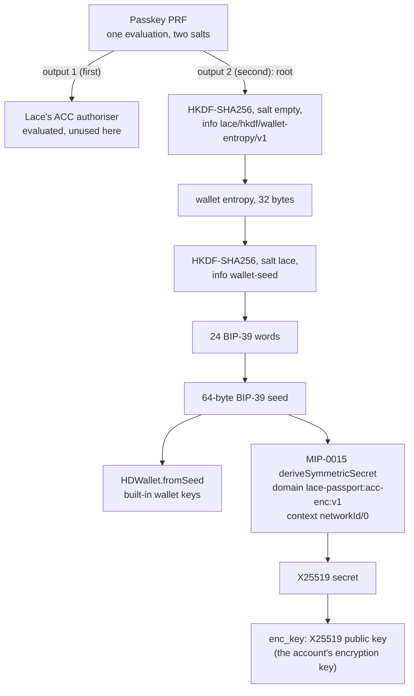

# Key derivation

The built-in wallet and the account's first encryption key both come from one secret: the
passkey's PRF output. The prototype follows the **Lace recipe v1**, so that the same passkey gives
the same wallet and the same account key here as in Lace. The code is
`packages/adapter-browser/src/lace-recipe.ts` and `prf.ts`. The tests reproduce Lace's own test
vectors (`tests/adapter-browser-lace-recipe.test.mjs`).

The passkey's signing key is a separate thing. It never leaves the authenticator and it never
derives from anything. It authorises the account directly (see
[the divergence from Lace](#the-divergence-from-lace)).

## Overview



## The PRF salts

One WebAuthn PRF evaluation takes two salts. Each salt is the SHA-256 of a UTF-8 label. The salts
are public domain separators, not secrets.

| Output        | Label                             | Role                                                            |
| ------------- | --------------------------------- | --------------------------------------------------------------- |
| `first` (#1)  | `lace-passport/prf/authoriser/v1` | Lace's ACC authoriser. Evaluated here, but not used.            |
| `second` (#2) | `lace/prf/root/v1`                | The root. The wallet seed and the account's key derive from it. |

The evaluation happens in one of two places. Some providers (Google Password Manager is expected
to) answer both salts already when the passkey is created. Others return only `prf.enabled` there,
so the page runs a separate PRF ceremony, pinned to the credential. The ceremony cannot share the
enrolment probe or a signing assertion, because PRF output adds extension data that the ACC's
signing profile (`wa-json134`) rejects.

A passkey with no PRF fails with `UnsupportedAuthenticator`. There is no fallback seed of any kind.

## HKDF to wallet entropy

```
entropy = HKDF-SHA256(ikm = root, salt = empty, info = "lace/hkdf/wallet-entropy/v1", length = 32)
```

The root must be exactly 32 bytes.

## To 24 words, then the BIP-39 seed

```
derived = HKDF-SHA256(ikm = entropy, salt = "lace", info = "wallet-seed", length = 32)
words   = BIP-39 entropyToMnemonic(derived)         24 English words
seed    = BIP-39 mnemonicToSeed(words, passphrase = "")     64 bytes
```

This is Lace's `Mnemonic.deriveFrom`. Thirty-two bytes of entropy always give 24 words. The built-in
wallet takes the 64-byte `seed` and passes it to `HDWallet.fromSeed`. Lace has no phrase-derived
Midnight wallet in scope yet, so this wallet is the prototype's stand-in.

## MIP-0015 to the account's encryption key

The account's `enc_key` is the X25519 public key of a secret that MIP-0015 v1
`deriveSymmetricSecret` derives from the BIP-39 seed. The function is ported verbatim from Lace.

| Input   | Value                                            |
| ------- | ------------------------------------------------ |
| Domain  | `lace-passport:acc-enc:v1`                       |
| Context | `<networkId>/0`, for the localnet `undeployed/0` |
| Length  | 32 bytes                                         |

The steps:

1. `master = HMAC-SHA512(key = "Symmetric key seed", data = seed)`.
2. A SLIP-0021 walk. A child node is `HMAC-SHA512(key = parent[0..32], data = 0x00 || label)`. Walk
   from `master` through the label `MIP-0015-connector-secret`, then through the NFC-normalised
   domain.
3. `secret = HKDF-SHA256(ikm = domainNode[32..64], salt = "MIP-0015:v1", info = domain || 0x00 || context, length = 32)`.
4. `enc_key = X25519 public key of secret`.

The function refuses a domain outside 1 to 256 bytes, a context over 1024 bytes and a length outside
16 to 64.

The context carries the network id, so the account's key is **bound to the network** and
reproducible from the passkey. Nothing stores it. The wallet seed itself is not network-bound, as in
Lace: the network separates wallets through address encoding and the wallet's network id.

## What is never stored

- **PRF outputs.** They live in memory only. Outputs the provider returned at creation sit in a
  module-private `WeakMap`, never on the credential object, so no spread, log, registry write or
  evidence can carry them. The encryption-key step takes them once and zeroes them. An entry nobody
  takes is zeroed after 60 seconds at most.
- **The root, the wallet entropy, the seed and the MIP-0015 secret.** Every intermediate byte array
  is zeroed after use. The caller of `passkeySeed` owns the seed and zeroes it after the wallet
  starts.
- **The 24 words.** They are a string, which JavaScript cannot zero. They never leave the module
  that derives them, and nothing displays, stores or logs them.
- **The passkey's private key.** It stays in the authenticator.
- **The sponsor's seed and the maintenance authority.** They exist only in the service process. The
  authority is generated for each deployment and retired in the last wave.
- **Anything secret in the evidence or the registry.** The registry holds the credential id,
  address, public key, policy, salt and status. The salt opens the boot commitment and is needed
  once, to activate. The rest is public.
- **Rotated encryption keys.** A rotation target is 32 random bytes from `crypto.getRandomValues`.
  Nothing keeps a copy, so data encrypted to a rotated key cannot be recovered.

The built-in wallet has no stored seed either. It derives it again from a PRF ceremony every time it
connects.

## The divergence from Lace

Lace's ACC authoriser is a **JubJub** key, derived from PRF output #1. This prototype uses the
ACC's **P-256 WebAuthn arm** instead. The passkey signs each call itself, and the ACC verifies the
signature on chain. So output #1 is evaluated, to keep the ceremony identical to Lace's, but it is
unused. The passkey's own P-256 key is the account's authority, and it is independent of the wallet
seed.

Lace has no rotation recipe yet, so `rotateEncryptionKey` takes a random key. That is a prototype
extension, not part of the recipe.

## The MIP-0015 labels are a draft

The MIP-0015 domain `lace-passport:acc-enc:v1` and the context `<networkId>/0` are draft labels.
They are the open MIP-0015 point in LW-15635. If Lace settles on other labels, the same passkey will
derive a different `enc_key`. Accounts created now would then carry a key that the final recipe
cannot reproduce. Treat any account made by this prototype as disposable.
