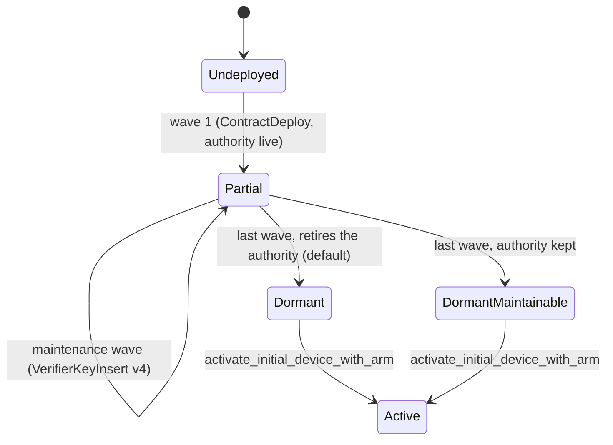
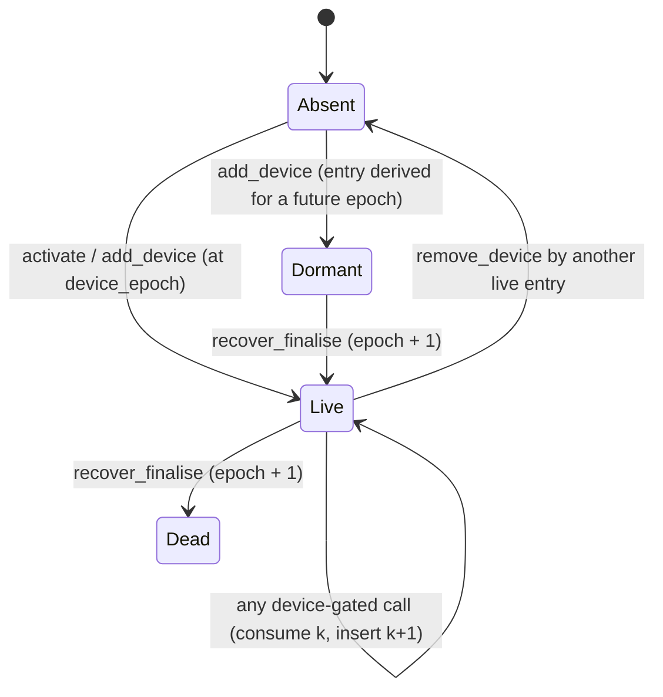
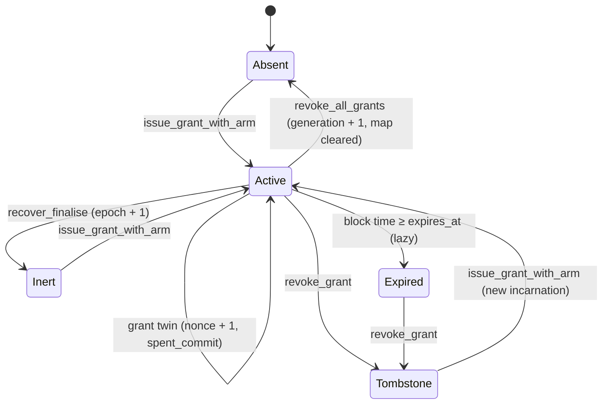
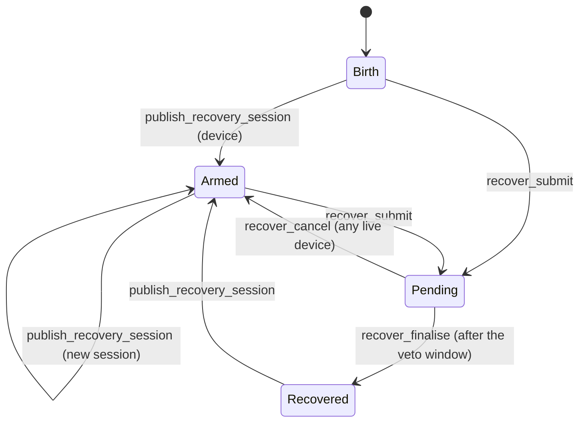

# FS-0.9 — The ACC artefact package over the Compact 0.35.0 reference ACC

> **Status:** draft for review · 2026/10/02 · written as an owner-directed design
> spike (not yet run through `mn-passport-skills:spec-author`); every decision
> marked **[PROPOSED]** awaits sign-off, and the ones that change a source doc
> need a `doc-sync` and an ADR before `spec-driver` may plan.
> **Milestone:** M0 — Foundations ([`roadmap.md`](../../roadmap.md) §2); extends
> [FS-0.2](./FS-0.2-contract-binding.md).
> **Brief:** [`M0-foundations.md`](../../milestones/M0-foundations.md) § FS-0.9.
> **Backing:** [`architecture.md`](../../../architecture.md) §4.4, §4.6, §8
> decision 2; FS-0.2 D-2, D-7, D-8, D-9, OQ-2, OQ-3, OQ-7;
> [ADR 0004](../../../adr/0004-artefact-hashes-committed-compiler-deterministic.md);
> [`provider-integration.md`](../../../provider-integration.md) §5.1, §6; the
> realignment proposal (`docs/proposals/2026-09-25-sdk-realignment.md`, branch
> `docs/sdk-realignment-proposal`) decisions 6 and 10 and its
> `mn-passport-contract` / `mn-passport-account` rows.
> **Reference contract:** the planning workspace's account custody contract,
> `contract/contracts/account.compact` at revision `a51e2c4` (`spec_version =
> 3`, caller-pinned scoped grants), based on `2e3c7ac` (Compact 0.35.0).
> Line references below (`AC:n`) are to that file at that revision.
> **Evidence:** [`experiments/acc-0.35/`](../../../../experiments/acc-0.35/README.md)
> (X1–X5, run 2026/10/02).
> **GitHub issue:** not named yet. Naming an upstream issue in this repository
> waits on the owner's decision about upstream references; `spec-driver` must
> not plan until one is named.

## 1. Objective

Make `mn-passport-contract` the **published, versioned ACC artefact package**:
the compiled reference ACC (generated module, types, contract info, ZKIR,
verifier keys, and the compiler's manifest) under the bindings FS-0.2 already
built, so a consumer — the SDK's own packages, a dApp composing the ACC, the
proving & settlement service — can build, prove, and verify calls without the
Compact toolchain. Prover keys travel separately.

Alongside it, fix the ACC **domain model and state machines** the SDK builds on
(§4–§5), so `mn-passport-account` (realignment proposal) and `core` derive their
types and guards from the contract rather than from the retired prototype.

## 2. Scope

### In

- The artefact build: canonical invocation, the 0.35.0 toolchain and its flags,
  determinism, the compiler manifest as the integrity anchor (§3 D-1, D-2).
- The package shape and size budget; prover keys out of the package (D-3, D-4).
- The binding registry, schema v2: one entry per supported ACC build (D-5, D-6).
- A binding surface generated from the artefact instead of hand-written for the
  prototype (D-7).
- The ACC domain model and state machines as the SDK's contract-facing model
  (§4–§5), and the split between `mn-passport-contract`, `mn-passport-account`,
  and `core` (D-8, D-9).
- The publish route (D-10), the deploy planner's inputs (D-11).

### Out

- Changes to the ACC itself; the P-256 WebAuthn arm (a separate, unmerged change
  upstream — the surface here must admit it, §6.3).
- Implementing `mn-passport-account` beyond the read model and guards this spec
  names; the grant ceremony and recovery UX.
- Publishing to npmjs or under `@midnight-ntwrk` — upstream's decision.

## 3. Decisions

| # | Decision | Rationale | Basis |
|---|---|---|---|
| D-1 | **[PROPOSED]** The SDK compiles the reference ACC itself, from a pinned source revision, with the **contract's own invocation**: from the contract directory, `compact compile +0.35.0 --feature-zkir-v3 contracts/account.compact contracts/managed/account`. `build-acc-artefact.mjs` adopts it (today it passes neither the version nor the flag, and an absolute source path). | All 147 artefact files are byte-identical across two independent builds (X1), so an SDK build is checkable against the contract team's. The flag is required: without it the ACC fails to compile (`unbound identifier Secp256k1EcdsaSignature`). The source map embeds invocation paths, so only the canonical invocation reproduces the manifest hash. | X1, X3; the contract's `package.json` `compile` script; ADR 0004 |
| D-2 | **[PROPOSED]** The integrity anchor of a binding is the **SHA-256 of the compiler-emitted `compiler/contract-manifest.json`**, committed in the registry. Loaders hand it to midnight-js 5 as `expectedManifestHash` with `verify: 'require'`. Per-file hashes leave the registry; per-circuit verifier-key hashes stay (from the module's `expectedVk`) for comparison with the chain. Amends ADR 0004. | Compact 0.35.0 emits the manifest (SHA-256 and size of every file, compiler commit, language and runtime versions); 0.31.1 did not. midnight-js 5 verifies against it and refuses a tampered key and a wrong pin with `ZkArtifactIntegrityError` (X4). Pinning the manifest hash is the mode its own docs call the only one that "resists a coordinated swap of the artifacts and their co-located manifest". | X1, X4; FS-0.2 T3 |
| D-3 | **[PROPOSED]** One package, `mn-passport-contract`, carries the bindings **and** each supported binding's artefact directory: module, types, contract info, manifest, ZKIR (text and binary), verifier keys, and the `.compact` source. **No prover keys.** | 0.28 MB packed / 2.88 MB unpacked per binding (X2). Matches the realignment map's "Bindings · artefacts" box and decision 6. ZKIR ships because key regeneration and the remote prover need it. | X2; realignment decision 6 |
| D-4 | **[PROPOSED]** Prover keys are a separate content-addressed bundle per binding, verified by the **same** manifest; key regeneration from ZKIR plus the on-chain verifier key replaces the bundle once the SDK exposes it. | 5,048 MB per binding (1,177 MB compressed); the largest key is 247.5 MB, against a 256 MB cap per npm version. The manifest lists the prover keys too, so an overlay of keys onto the package verifies and proves (X5). | X1, X2, X5; provider-integration §6 |
| D-5 | **[PROPOSED]** A binding id names the on-chain schema and the build: `acc-s<spec_version>r<recovery_version>.<n>` (first: `acc-s3r1.1`). The registry entry records the source revision, toolchain (compiler, commit, language, runtime, flags), manifest hash, schema markers, and the roster. | The contract carries `spec_version` and `recovery_version` in its ledger (AC:193, AC:315), which answers FS-0.2 OQ-7 for new deployments. A schema bump is a fresh deployment (`spec_version` 3 is "a fresh-deployment schema"). | FS-0.2 D-8, OQ-7 |
| D-6 | **[PROPOSED]** **All bindings in one package release share one Compact runtime version**, declared as an exact peer dependency. A binding built for another runtime cannot be loaded and is retired from the registry in the release that moves the runtime. | The generated module refuses a mismatched runtime: "Version mismatch: compiled code expects 0.20.0, runtime is 0.16.0" (X3). The prototype binding (runtime 0.16.0) therefore leaves the registry when 0.20.0 arrives. This constrains FS-0.2 D-8: multi-version means multi-build within one runtime. | X3; FS-0.2 D-8, D-9 |
| D-7 | **[PROPOSED]** The binding surface is **generated at pin time** from the artefact (`contract/index.d.ts`, `contract-info.json`, `circuitSignatures`), not hand-written: a per-binding circuit catalogue (§6.1) and structural module types. `bindAccModule` validates a loaded module against the catalogue. | The hand-written surface is the prototype's (`derive_device_commitment`, three witnesses, a 2-argument constructor); none of it exists in the reference ACC (one witness, `held_coin`; 45 per-arm pure circuits; a 5-argument constructor). 9 of 32 SDK tests fail on the new binding for exactly these reasons (X3). Generation keeps D-9's no-static-import rule. | X3; FS-0.2 D-9 |
| D-8 | **[PROPOSED]** Package split (aligns the realignment proposal): `mn-passport-contract` = artefact + bindings + catalogue + the ledger read projection; `mn-passport-account` = the domain model of §4, the state machines of §5 as pure functions of the ledger view, the per-arm challenge builders and call-argument assembly, the deploy planner; `core` = the ceremony gate, private state, and the `held_coin` witness. | The ledger is authoritative (architecture §8 Q5 consequence); a read model derived from it, not local truth, keeps `connect` and the agent library free of `core` (architecture §4.4). | architecture §4.1, §4.4; realignment `mn-passport-account` row |
| D-9 | **[PROPOSED]** Challenge preimages are computed **by calling the artefact's exported pure circuits** (`challenge_*`, `derive_*`), never re-implemented in TypeScript. | The 45 pure circuits are the contract's own derivation surface; the reference client depends on `node:crypto` for its re-implementations, which a browser SDK cannot use; one implementation removes drift. | AC pure circuits; reference client `signer.ts` |
| D-10 | **[PROPOSED]** Publishing: GitHub Packages under the owning account's scope (`@input-output-hk/mn-passport-contract`) from a `fork-only:` manual workflow; the registry rule in `CLAUDE.md` changes through `doc-sync` with an ADR. | GitHub Packages caps a version at 256 MB, requires a token to install even public packages, and scopes names to the owner. | review brief D2, D6 |
| D-11 | **[PROPOSED]** The deploy planner takes its inputs from the binding: each circuit's verifier-key size (wave budget, default 15,000 bytes), the roster order, and the authority-retirement step as an explicit, irreversible, ceremony-gated action. | A full deploy exceeds a block: 36 circuits plan as 7 waves (X5 reproduced the plan). compact-js's ledger-9 binding still writes `v3` operations while 0.35.0 emits `v4` keys, so maintenance waves are built by hand today. | X5; reference `wave-deploy.ts` |

## 4. Domain model

The contract has 25 ledger cells (AC:177–329), 36 impure circuits, 45 exported
pure circuits, and one witness. Grouped as aggregates:

| Aggregate | Ledger cells | Notes |
|---|---|---|
| **Account** | `round`, `auth_nonce`, `enc_key`, `boot`, `booted`, `spec_version`, `recovery_version` | `round` advances on every call; `auth_nonce` only on device-gated calls and `recover_finalise` — it is the freshness input of every device and recovery challenge. |
| **Device set** | `devices: Set<Bytes<32>>`, `device_epoch`, `device_count` | The contract knows **entries**, not devices: `entry = H(tag, self, pk[, envelope], epoch, use_counter)`. Every device-gated call consumes the caller's entry and inserts its successor at `use_counter + 1`. `device_count` is not a device count (erratum 8). |
| **Grants** | `grants: Map<grant_id, GrantRecord>`, `grant_generation` | `GrantRecord` = epoch, generation, `issued_at`, nonce, `spent_commit`, window fields (reserved, 0), active, scope. `GrantScope` (13 fields) includes the salted `caller_commit` (0 = unrestricted). |
| **Recovery** | `recovery_pk`, `recovery_phi[0..3]`, `recovery_phi_len`, `recovery_session`, `recovery_wrap`, `pending_*`, `veto_window` | Guardian shares publish a fresh recovery key; a submission is pending for the veto window, then finalised permissionlessly. |
| **Inbox** | `inbox: Map<Uint<64>, Bytes<192>>`, `inbox_count` | Append-only, sealed to `enc_key`; how a client rediscovers shielded coins. |
| **Balances** | `unshielded_balances: Map<color, Uint<128>>` | Shielded coins have no ledger cell; they enter calls through the `held_coin` witness. |

**Value objects the SDK types:** `Arm = 'jubjub' | 'k256'` (and `'p256'` when
that arm lands); `Envelope = 0 | 1` (k256 only: raw, or the dApp-connector
prefix `midnight_signed_message:32:`); `DeviceEntry`; `GrantId`
(`H(tag, self, pk[, envelope], origin_hash, slot)`); `GrantScope`;
`CallerPin` (`{ kind: 'any' } | { kind: 'contract', address, salt }`);
`RecoveryArtefactSet`.

**Circuit catalogue (36), by gate:**

| Gate | Circuits | Notes |
|---|---|---|
| Permissionless (5) | `deposit_unshielded`, `deposit_shielded`, `activate_initial_device_with_{jubjub,k256}`, `recover_finalise` | Activation opens the boot commitment; finalise checks block time. |
| Device (24) | `{withdraw_unshielded, withdraw_shielded†, withdraw_shielded_to_contract†, append_inbox, rotate_enc_key, add_device, remove_device, issue_grant, revoke_grant, revoke_all_grants, publish_recovery_session, recover_cancel}_with_{jubjub,k256}` | All advance `auth_nonce`. † reads the `held_coin` witness, so another contract cannot call it. |
| Grant (6) | `{withdraw_unshielded, withdraw_shielded†, withdraw_shielded_to_contract†}_with_grant_{jubjub,k256}` | Never touch `auth_nonce`; read `kernel.caller()` only when the grant is caller-pinned; read block time only when it expires. |
| Recovery key (1) | `recover_submit` | Schnorr under the recovery key plus a co-signature by the successor. |

**Authorisation.** Device challenges are `persistentHash` preimages over a
per-operation domain tag, the account address, the key, the operation's
arguments and witness values, and `auth_nonce` (JubJub also binds `sig_r` and a
grind nonce). Grant challenges bind `grant_id`, `issued_at`, and the record's
nonce. The caller pin is bound only by the owner's issue signature, through the
`grant:scope:v2` digest; for `A → B → account` the account enforces **B**.

## 5. State machines

All four are functions of the ledger view, not of local state (D-8).

### 5.1 Account



Guards: activation needs `!booted` and the boot commitment's opening (the
**boot salt**, which must be persisted between deploy and activation — the
reference client keeps it only in memory). A retired account can never gain a
circuit, so the roster at retirement is permanent.

### 5.2 Device entry



The `Dormant → Live` edge is erratum 7: `recover_finalise` advances the epoch
without clearing the set, so a pre-planted entry survives recovery (finding
recorded; not filed). The SDK must treat the device set as untrustworthy after
a suspected compromise and surface `device_count` as an entry count.

### 5.3 Grant



An expired grant blocks re-issue until revoked. A caller-pinned twin fails when
called directly ("grant requires a contract caller"). Removing a device does not
cascade to grants; the owner's client must follow it with `revoke_all_grants`.

### 5.4 Recovery



A submission is invalidated by any device-gated call before its inclusion (it
signs `auth_nonce`), so a hostile live device can starve recovery as well as
cancel it.

## 6. Surface and interfaces (indicative)

### 6.1 The binding (generated per binding, `mn-passport-contract`)

```ts
export type AccArm = 'jubjub' | 'k256';
export type AccGate = 'permissionless' | 'device' | 'grant' | 'recovery-key';

/** One impure circuit of a binding — generated from the artefact (D-7). */
export interface AccCircuitPin {
  readonly name: string;
  readonly arm: AccArm | 'none';
  readonly gate: AccGate;
  /** Reads the held_coin witness: not callable from another contract. */
  readonly usesWitness: boolean;
  readonly readsCaller: 'never' | 'when-pinned';
  /** From the module's expectedVk; compared with the deployed key. */
  readonly verifierKeySha256: string;
  /** Wave planning input (D-11). */
  readonly verifierBytes: number;
}

/** One supported ACC build — the binding axis (architecture §4.6). */
export interface AccBindingV2 {
  readonly id: string; // 'acc-s3r1.1'
  readonly provisional: boolean;
  readonly source: { readonly revision: string; readonly path: string; readonly sha256: string };
  readonly toolchain: {
    readonly compiler: string; // '0.35.0'
    readonly compilerCommit: string;
    readonly language: string; // '0.27.0'
    readonly runtime: string; // '0.20.0' — equals the package's runtime peer (D-6)
    readonly flags: readonly string[]; // ['--feature-zkir-v3']
  };
  /** SHA-256 of compiler/contract-manifest.json (D-2). */
  readonly manifestSha256: string;
  readonly schema: { readonly specVersion: number; readonly recoveryVersion: number };
  readonly roster: readonly AccCircuitPin[];
  readonly pureCircuits: readonly string[];
}

/** What a platform adapter passes to midnight-js 5's ZK config providers. */
export interface AccZkConfigOptions {
  readonly verify: 'require';
  readonly expectedManifestHash: string;
}
```

`mn-passport-contract` stays dependency-free (FS-0.2 D-7): it hands
`AccZkConfigOptions` to the platform adapter, which constructs the midnight-js
provider over the package's artefact directory (Node) or its served copy
(browser).

### 6.2 The read model and guards (`mn-passport-account`)

```ts
export type AccountPhase =
  | { readonly kind: 'partial'; readonly installed: number; readonly total: number }
  | { readonly kind: 'dormant'; readonly maintainable: boolean }
  | { readonly kind: 'active' };

export type RecoveryPhase =
  | { readonly kind: 'birth' }
  | { readonly kind: 'armed'; readonly session: Uint8Array }
  | { readonly kind: 'pending'; readonly notBefore: bigint };

export type GrantStatus = 'active' | 'expired' | 'tombstone' | 'inert';

/** Pure projection of the ledger view; never cached as truth. */
export interface AccountView {
  readonly binding: string;
  readonly phase: AccountPhase;
  readonly authNonce: bigint;
  readonly deviceEpoch: number;
  readonly entryCount: number; // not a device count (erratum 8)
  readonly recovery: RecoveryPhase;
  grant(id: Uint8Array, now: bigint): GrantStatus | undefined;
}

/** A guard mirrors the circuit's asserts so a call fails before proving. */
export type Guard = (view: AccountView) => { readonly ok: true } | { readonly ok: false; readonly reason: string };
```

### 6.3 Signers

One port per arm, all asynchronous so a WebAuthn ceremony fits: `jubjub`
(Schnorr with challenge grinding), `k256` (ECDSA over the envelope digest), and
later `p256` (the WebAuthn profile the contract team has prototyped). Signers
receive the 32-byte challenge from §D-9's pure circuit, never the call.

## 7. Flow

1. **Build** (CI, Nix toolchain): canonical compile → `contract-manifest.json` →
   catalogue and types generated → registry entry with `manifestSha256`.
2. **Check**: rebuild and compare (determinism, ADR 0004); compare verifier-key
   hashes with the contract team's published set or the chain.
3. **Pack**: package with the artefact directories; size budget (≤ 5 MB unpacked
   per binding); consumer smoke (X4) on the packed tarball.
4. **Publish**: package to GitHub Packages (D-10); prover-key bundle beside it
   (D-4).
5. **Consume**: adapter builds midnight-js providers with the pinned manifest;
   `mn-passport-account` reads the ledger, evaluates guards, computes the
   challenge with the pure circuit, asks the arm's signer, assembles call
   arguments, and hands off to the prover and broadcast seams.

## 8. Evidence (2026/10/02, `experiments/acc-0.35`)

| | Result |
|---|---|
| X1 build | 328 s, 2.54 GB peak; 36 proving + 45 pure circuits; module 1.6 MB, ZKIR 0.8 MB + 0.2 MB binary, verifier keys 88.6 KB, prover keys 5,048 MB (largest 247.5 MB, the k256 recovery circuits); manifest lists all 148 files, all match |
| Determinism | A second, independent build (the SDK script): all 147 artefact files byte-identical; only the manifest hash differs, through the source map's embedded paths |
| X2 pack | client set 0.18 MB packed / 1.83 MB; with ZKIR 0.28 MB / 2.88 MB; with prover keys 1,177 MB / 5,051 MB |
| X3 SDK | registry and pin script carry over; 9 of 32 tests fail: runtime pin (2), prototype circuit names (6), prototype module shape (1) |
| X4 consume | 36/36 circuits load through midnight-js 5 with the manifest pinned; tamper and wrong pin refused with `ZkArtifactIntegrityError`; module exports `Contract`, `ledger`, `pureCircuits` (45), `circuitSignatures` (81), `declaredInterfaces` (0), `expectedVk` |
| X5 localnet | **PASS** (542 s): the contract team's caller-pin conformance scenario, unmodified, ran from the package plus a prover-key overlay — 7-wave deploy and authority retirement, 8 accepted transactions (incl. B → account and A → B → account), 3 local refusals, and a forged caller context refused by the node (RPC 104) |

## 9. Dependencies

- FS-0.2 (the registry, loader, and binder this spec changes).
- The contract team's build: a published source revision per binding, ideally
  their manifest hash, to make correspondence a one-hash check.
- compact-js support for `v4` operations (until then, maintenance waves are hand-built).
- The SDK's runtime moving to 0.20.0 (the pending dependency bump).

## 10. Acceptance criteria

1. `pnpm run build:artefact -- --pin acc-s3r1.1 --current` reproduces the
   committed `manifestSha256` from the pinned revision in the Nix shell.
2. The packed `mn-passport-contract` is ≤ 5 MB unpacked per binding and has no
   `.prover` file.
3. Every roster circuit's ZKIR and verifier key load from the packed tarball
   through midnight-js 5 with the pinned manifest; a flipped byte and a wrong
   pin both fail with `ZkArtifactIntegrityError`.
4. `bindAccModule` accepts the reference module and rejects the prototype's.
5. On the localnet, an account deploys in waves from the package's verifier
   keys plus the prover bundle, activates, and accepts one device-gated call.

## 11. Verify plan

`mn-passport-skills:verify` drives criteria 1–5 with the `experiments/acc-0.35`
scripts promoted into `scripts/` and the localnet compose in `infra/localnet`.
Nothing is mocked: every gate is local.

## 12. Proposed tranches

| # | Concern | Size |
|---|---|---|
| T1 | `build-acc-artefact.mjs`: compiler pin, `--feature-zkir-v3`, canonical invocation; registry schema v2 (`manifestSha256`, toolchain, schema, roster) | ~4 files, ≤ 250 lines |
| T2 | Re-pin to the reference ACC (`acc-s3r1.1`); runtime 0.20.0; retire the prototype binding (D-6); de-prototype the tests | ~6 files + generated, ≤ 300 lines |
| T3 | Generated catalogue and structural types; new `bindAccModule` (D-7) | ~5 files, ≤ 350 lines |
| T4 | Package assembly, size budget, consumer smoke on the tarball | ~4 files, ≤ 250 lines |
| T5 | `mn-passport-account` read model and guards (§5, §6.2) | ~5 files, ≤ 400 lines |
| T6 | Deploy planner (waves, retirement as a ceremony step) | ~4 files, ≤ 350 lines |
| T7 | Publish workflow (`fork-only:`) and the prover-key bundle | ~4 files, ≤ 250 lines |

## 13. Respecting the normative MUSTs

- **Ceremony gate** — unchanged: secrets stay in `core`; the package ships
  public artefacts only; authority retirement is a ceremony-gated step (D-11).
- **Encrypt the preimage to the enclave** — unchanged; this spec moves no
  preimage.
- **Deposit, not address** — `deposit_*` stay in the catalogue as the payment
  path.
- **`connect` never links `core`** — the read model and guards live in
  `mn-passport-account`, which `connect` may link.
- **Two version axes** — the binding id (D-5) is the binding axis; nothing here
  touches the wire axis.

## 14. Open questions

| # | Question | Owner |
|---|---|---|
| OQ-1 | The anchor issue (see the header). | Owner |
| OQ-2 | Does the contract team publish its manifest hash per release? It turns correspondence into one comparison. | Contract team |
| OQ-3 | Bind `spec_version = 3` now, or wait for the erratum 7 and 8 fixes, both of which are redeploys? | Owner + contract team |
| OQ-4 | The P-256 WebAuthn arm adds circuits; does it land before the first published binding? | Contract team |
| OQ-5 | Which source revision is canonical for `acc-s3r1.1` once the caller-pin change merges? | Contract team |
| OQ-6 | Where does the prover-key bundle live, and who pulls it — the proving & settlement service, the SDK, or both? | Owner + service |
| OQ-7 | Should the package ship `account.compact` for composition, or a curated interface listing only the circuits another contract may call? | Owner |
