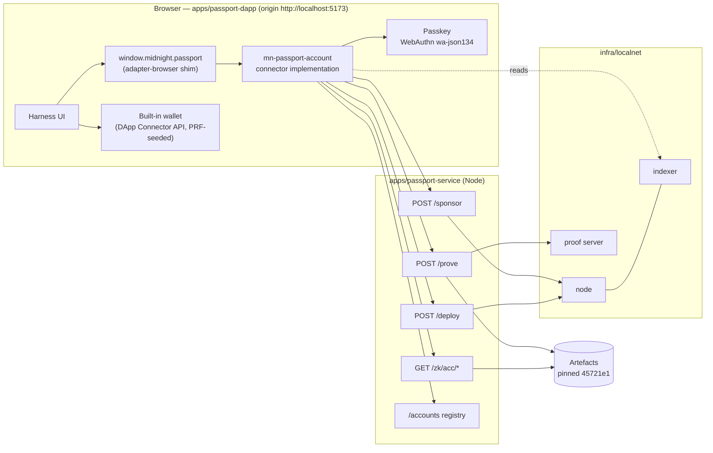

# Passport DApp prototype — design

> **Status:** draft for review · 2026/10/06 · prototype (MVP), branch
> `passport-acc-prototype` of the fork. Not a source-of-truth doc: accepted
> parts move into `docs/` through `doc-sync` with an ADR each.
> **Serves:** Lace epic LW-15579 (Passport smart account as the Lace account
> model), to unblock LW-15635 (passkey Passport account) **on the standalone
> network**. Evidence base: `experiments/acc-0.35` (X1–X7).

## 1. Goal

Give the Lace team a working **prototype of the Midnight Passport DApp
Connector API** that lace-sdk (lace-platform's library for browser apps, which
contains the Midnight wallet) can consume from this fork, together with a
**Passport web app** that does the heavy lifting: it distributes the ACC's ZK
artefacts over HTTP, proves the large circuits server-side, deploys accounts,
and sponsors fees, so nothing large or secret has to live in the browser.

The official Passport connector API does not exist yet; this one is a
prototype that it may borrow from.

### 1.1 MVP use case — new user, passkey first

1. The user creates a passkey in the web app.
2. A Passport account (the ACC) is deployed for it, fee-sponsored: the user
   holds no tokens.
3. The passkey is installed as the account's first device.
4. One transaction **authorised by the passkey** confirms.
5. After a page reload the **same passkey reopens the same account**.
6. A built-in Midnight wallet, derived from the passkey's PRF output, is
   connected through the standard Midnight DApp Connector API to show that
   wallet integration works.

Mapping to LW-15635's definition of done, on the standalone network:

| LW-15635 item | Here |
|---|---|
| A passkey creates a Passport account, and a transaction from it confirms | Steps 1–4 |
| The fee sponsor ships no funded secret inside the web app | The sponsor key lives only in the service (§4.4) |
| The same passkey reopens the same account after a reload | Step 5 (§5.3) |
| Account keys are bound to the network | Network id in the registry key and the PRF salt (§5.4) |
| The run is recorded | The app's evidence panel plus an end-to-end script (§8) |

### 1.2 Out of scope (MVP)

- The existing-wallet scenario ("add a passkey to an existing Midnight
  wallet"); grants, recovery, withdrawals.
- A public testnet: the standalone localnet only (LW-15635 itself targets
  testnet; this unblocks the same flow locally).
- Wiring into lace-platform: the fork stays self-contained; lace-sdk imports
  the packages and replaces the built-in wallet with its own.
- Publishing packages (FS-0.9 owns that); refactoring `mn-passport-contract`
  onto the 0.35.0 binding (FS-0.9 T1–T3).

## 2. Constraints from the evidence

| Constraint | Source | Consequence |
|---|---|---|
| The ACC (`45721e1`, 52 circuits) has 12.2 GB of prover keys; 15 single keys exceed 256 MB | X6 | Keys never travel to the browser; they stay on the service's disk |
| Our Nix build equals the contract team's in all 162 published hashes | X6 | The service may generate its artefacts from the pinned revision and pin the manifest hash |
| P-256 account proofs need about 13.5 GiB in the proof server; 8 GiB fails | X7 | The service's proof server runs with Docker memory ≥ 24 GiB |
| `activate_initial_device_with_p256(pk, salt, policy)` takes no signature and is k = 14 | ACC source | Activation is cheap; the first heavy proof is the first passkey-signed call |
| The WebAuthn profile `wa-json134` requires a 134-byte `clientDataJSON` and a **21-byte origin** | `webauthn.ts` | The dev origin is `http://localhost:5173` (exactly 21 bytes) |
| midnight-js 5's proving seam is `prove(serializedPreimage, keyLocation, overwriteBindingInput)` and the proof server's `/prove` takes the preimage plus key material | `midnight-js-http-client-proof-provider` | A browser `ProvingProvider` can forward the preimage and key location only; the service attaches the keys |
| Deploying exceeds a block; the reference deploys in 10 waves within a 15,000-verifier-byte budget, with hand-built maintenance updates | X7, `wave-deploy.ts` | Deployment is a service job |
| The SDK forbids versions younger than 7 days without a recorded exception | `CLAUDE.md` | Each pre-release dependency gets a recorded `minimumReleaseAgeExclude` entry, or waits |

## 3. Architecture



### 3.1 Units

| Unit | Responsibility | Depends on |
|---|---|---|
| `packages/protocol` (existing) | Adds the **prototype connector types**: `PassportConnectorAPI`, its request/response shapes, error codes, `PASSPORT_CONNECTOR_VERSION = '0.1.0-prototype'`. Types and constants only. | — |
| `packages/account` (new, `@midnight-ntwrk/mn-passport-account`) | The connector **implementation**, platform-neutral: account state read from the indexer, MVP flows (create, open, rotate), P-256 challenge via the artefact's pure circuits, call assembly. Talks to the service and the passkey through injected seams. | `protocol`, `contract` (allowed graph) |
| `packages/adapter-browser` (new) | Browser seams: WebAuthn `wa-json134` passkey adapter (create credential, assertion, PRF), `fetch` clients for the service, a midnight-js `ProvingProvider` that delegates to `/prove`, and the **shim** `injectPassportConnector(window, connector)`. | `account`, `contract`, `protocol` |
| `apps/passport-service` (new, Node) | ZK artefact host, delegated prover, deploy job, fee sponsor, account registry. Holds the only funded key. | the localnet, the pinned artefacts |
| `apps/passport-dapp` (new, Vite) | Harness UI; hosts the built-in wallet (a stand-in for lace-sdk's); injects the connector through the shim; shows evidence. | `adapter-browser`, `account`, `protocol` |

`scripts/dependency-graph.mjs` gains `account: ['contract', 'protocol']` and
`'adapter-browser': ['account', 'contract', 'protocol']`; `apps/*` join the
pnpm workspace and stay outside the graph, which governs packages only.

## 4. Interfaces

### 4.1 Prototype Passport DApp Connector API (`protocol`)

```ts
export const PASSPORT_CONNECTOR_VERSION = '0.1.0-prototype';

export interface PassportConnectorAPI {
  readonly apiVersion: typeof PASSPORT_CONNECTOR_VERSION;
  /** Network the connector is bound to, e.g. 'undeployed'. */
  readonly networkId: string;
  /** Creates a passkey, deploys an ACC for it, installs it as the first device. */
  createAccount(options: CreateAccountOptions): Promise<PassportAccount>;
  /** Asks for an existing passkey and reopens its account on this network. */
  openAccount(): Promise<PassportAccount>;
}

export interface CreateAccountOptions {
  readonly userName: string;
  readonly onProgress?: (step: CreateAccountStep) => void;
}

export type CreateAccountStep =
  | 'passkey-created' | 'deploying' | 'deployed' | 'activating' | 'active';

export interface PassportAccount {
  readonly address: string;
  readonly networkId: string;
  readonly bindingId: string; // the artefact revision, e.g. 'acc-45721e1'
  /** Live state read from the indexer. */
  state(): Promise<PassportAccountState>;
  /** MVP passkey-authorised call: rotates the account's encryption key. */
  rotateEncryptionKey(newKey: Uint8Array): Promise<PassportTxResult>;
}

export interface PassportAccountState {
  readonly booted: boolean;
  readonly authNonce: bigint;
  readonly deviceEpoch: number;
  readonly entryCount: number; // not a device count (erratum 8)
  readonly specVersion: number;
}

export interface PassportTxResult {
  readonly txHash: string;
  readonly blockHeight?: number;
}

export type PassportErrorCode =
  | 'UserCancelled' | 'UnsupportedAuthenticator' | 'AccountNotFound'
  | 'ArtefactIntegrity' | 'ProverUnavailable' | 'SponsorRejected'
  | 'NetworkMismatch' | 'InternalError';

export interface PassportError extends Error {
  readonly type: 'PassportConnectorError';
  readonly code: PassportErrorCode;
}
```

Discovery mirrors the DApp Connector convention: the shim sets
`window.midnight.passport = { name, apiVersion, connect(networkId) }`, and
`connect` returns the `PassportConnectorAPI`. lace-sdk can either inject the
same object or import `createPassportConnector(seams)` from `account` and wire
its own seams.

### 4.2 Seams the implementation consumes (`account`)

```ts
export interface PassportSeams {
  readonly networkId: string;
  readonly passkey: PasskeySeam;      // WebAuthn in the browser; a software ES256 signer in tests
  readonly service: ServiceSeam;      // HTTP client for apps/passport-service
  readonly provingProvider: unknown;  // midnight-js ProvingProvider delegating to /prove
  readonly indexer: { readonly uri: string; readonly wsUri: string };
}
```

### 4.3 Service HTTP API (`apps/passport-service`)

All JSON over HTTP, CORS restricted to the dapp origin. Binary values are hex.

| Endpoint | Request | Response | Notes |
|---|---|---|---|
| `GET /config` | — | `{ networkId, bindingId, manifestSha256, indexerUri, indexerWsUri, nodeUri }` | The connector checks `networkId` and pins `manifestSha256` |
| `GET /zk/acc/{compiler,zkir,keys}/…` | — | the file, `application/octet-stream` | Layout `FetchZkConfigProvider` expects; immutable cache headers, manifest `no-cache`. Prover keys are served (for completeness and other consumers) but the dapp never fetches them |
| `POST /prove` | `{ serializedPreimage, keyLocation, overwriteBindingInput? }` | the proof bytes | Resolves `keyLocation` to the circuit, loads ZKIR and keys from disk, calls the proof server's `/prove` with the full payload. Allow-listed to the binding's circuits |
| `POST /deploy` | `{ boot, encKey, recoveryPk, recoveryWrap, vetoWindowSeconds }` | `{ address, txHashes[] }` (streams progress) | Constructor arguments only; runs the 10 waves and retires the authority in the last |
| `POST /sponsor` | `{ tx }` (proven, unbalanced) | `{ txHash, blockHeight }` | Adds fees from the sponsor wallet, submits, waits for inclusion. Allow-listed to the binding's contract calls |
| `PUT /accounts/{networkId}/{credentialId}` | `{ address, publicKey, salt, policy }` | `204` | The registry (§5.3) |
| `GET /accounts/{networkId}/{credentialId}` | — | `{ address, publicKey, salt, policy }` or `404` | |

### 4.4 Secrets and authority

- The **sponsor key** (the localnet's genesis seed) and the **maintenance
  authority key** exist only in the service process. The authority is
  generated per deployment and **retired in the last wave**, so a deployed
  account can never be upgraded: the irreversible choice the epic's risk 12
  asks to record. A later decision can keep it instead.
- The **passkey's private key** never leaves the authenticator. The
  account's authority is the passkey's P-256 key (installed by activation).
- The **wallet seed** comes from the passkey's PRF output at a separate,
  network-bound salt; it never authorises the ACC (AUTH-7: the authoriser is
  independent of the wallet seed).

## 5. Flows

### 5.1 Create (MVP)

1. `connect('undeployed')` → `GET /config`; refuse on network mismatch.
2. Passkey: `createBrowserCredential(rpId='localhost', origin='http://localhost:5173')`
   as a **discoverable** (resident) ES256 credential, so §5.3 can find it
   without a stored id → credential id, P-256 public key; PRF evaluated where
   supported.
3. Generate `salt` and an X25519 encryption key pair; compute
   `boot = derive_boot_commitment_with_p256(salt, pk, policy)` with the
   artefact's pure circuit.
4. `POST /deploy` with the constructor arguments → address (≈ 10 waves).
5. Build `activate_initial_device_with_p256(pk, salt, policy)`; prove through
   `/prove` (k = 14); submit through `/sponsor`.
6. `PUT /accounts/undeployed/{credentialId}`; return the `PassportAccount`.

### 5.2 Transact (MVP)

`rotateEncryptionKey(newKey)`: read `auth_nonce` from the indexer; compute
`challenge_rotate_enc_key_with_p256(address, pk, newKey, authNonce)` with the
pure circuit; ask the passkey for an assertion over it; build
`rotate_enc_key_with_p256(newKey, auth)`; prove through `/prove` (k = 18,
≈ 30 s, ≈ 13.5 GiB on the service's proof server); submit through
`/sponsor`.

### 5.3 Reopen after reload

`openAccount()`: a discoverable-credential assertion returns the credential id;
`GET /accounts/undeployed/{credentialId}` returns the address and public key;
the account's live state is read from the indexer. The registry is the MVP's
discovery mechanism; the epic's A6 (discovery on a new device) is a later
decision — a name lookup or chain scan.

### 5.4 Network binding

The registry is keyed by `networkId`; the wallet's PRF salt is
`"midnight:passport:wallet:v1:" + networkId`; the connector refuses a service
whose `networkId` differs from its own. The ACC encryption context also takes
the network id (the open MIP-0015 point in LW-15635).

### 5.5 Built-in wallet

An in-page wallet built on the Midnight wallet SDK against the standalone
node and indexer, seeded from the PRF output (or a dev seed when PRF is
unavailable), exposed as `window.midnight.devwallet` with the standard DApp
Connector `InitialAPI` / `ConnectedAPI` subset the harness uses:
`connect('undeployed')`, `getConfiguration`, `getConnectionStatus`,
`getShieldedAddresses`, `getUnshieldedAddress`, `getDustAddress`, the three
balance getters. The harness shows these to prove wallet integration. The ACC
flows do not depend on the wallet: fees are sponsored.

## 6. Errors

The connector maps failures to `PassportErrorCode`: a WebAuthn
`NotAllowedError` → `UserCancelled`; no PRF or ES256 → `UnsupportedAuthenticator`;
`404` from the registry → `AccountNotFound`; `ZkArtifactIntegrityError` →
`ArtefactIntegrity`; `/prove` 5xx or timeout → `ProverUnavailable`;
`/sponsor` refusal → `SponsorRejected`. The service fails closed when its
artefact directory does not match the pinned manifest hash, and refuses
circuits or contracts outside the binding.

## 7. Repository layout and build

```
apps/passport-service/   Node HTTP server (no framework beyond node:http), tests
apps/passport-dapp/      Vite app, port 5173; built-in wallet under src/wallet
packages/account/        connector implementation (platform-neutral)
packages/adapter-browser/ WebAuthn, fetch clients, delegated ProvingProvider, shim
packages/protocol/       + connector types
```

- Artefacts: produced by `experiments/acc-0.35/compile.sh <dir> full` from the
  pinned revision `45721e1`; the service reads them from
  `PASSPORT_ARTEFACT_DIR` and checks the manifest hash at start-up. The dapp
  bundles the generated contract module from the same directory.
- Everything runs in the Nix shell; the localnet from `infra/localnet` with
  Docker memory ≥ 24 GiB.
- One command starts the stack: `pnpm prototype:up` (localnet, service, dapp).

## 8. Testing

| Level | What |
|---|---|
| Unit (`node --test`, repo style) | Connector flows against fake seams; error mapping; service routes against a fake proof server and node; registry; the shim |
| Integration | The service against the real localnet: `/zk` serves byte-identical files under the pinned manifest, `/prove` proves `activate_initial_device_with_p256`, `/deploy` deploys |
| End-to-end script | `apps/passport-dapp/e2e`: drives create → activate → rotate → reopen through the real connector with a software ES256 authenticator under `wa-json134` (as the contract team's tests do), records network, address, and transaction hashes |
| Manual, recorded | The same flow with a real passkey in a browser at `http://localhost:5173`; evidence (address, hashes, steps) exported from the app into `experiments/acc-0.35/results/` |

## 9. Delivery

Small, reviewable commits on `passport-acc-prototype`, in this order:
protocol types → service (zk, config, registry) → service (prove) → service
(deploy, sponsor) → account (create/open/rotate) → adapter-browser (passkey,
clients, shim) → dapp (wallet, UI, evidence) → end-to-end script → recorded
manual run. The implementation plan breaks these into tasks.

## 10. Risks and open questions

| # | Item | Mitigation / owner |
|---|---|---|
| R1 | The midnight-js 5 / wallet SDK pre-releases are young (7-day rule) and their browser builds may need polyfills | Record exclusions; the passport PWA demo runs the wallet SDK in a tab, so a known path exists |
| R2 | Building ACC calls in the browser needs the generated module and the wave-deploy helpers, which live in the contract team's TypeScript, not in a package | Port the minimum (challenge, call, activation) into `account`; the service reuses the reference wave-deploy logic |
| R3 | Sponsoring a transaction built elsewhere (balance with the sponsor's dust, then submit) | Balance on the service with the sponsor wallet's balancing API; fall back to the service building the whole call if needed |
| R4 | Docker memory for P-256 proofs | Documented ≥ 24 GiB; `/prove` reports `ProverUnavailable` clearly |
| Q1 | Retire the authority at deploy (default) or keep it? | Owner decision (epic risk 12) |
| Q2 | Registry vs WebAuthn largeBlob vs name lookup for reopening on a new device | Later (epic A6, risk 14) |
| Q3 | Does lace-sdk inject `window.midnight.passport` or import the factory? | Both supported; Lace team to choose |
