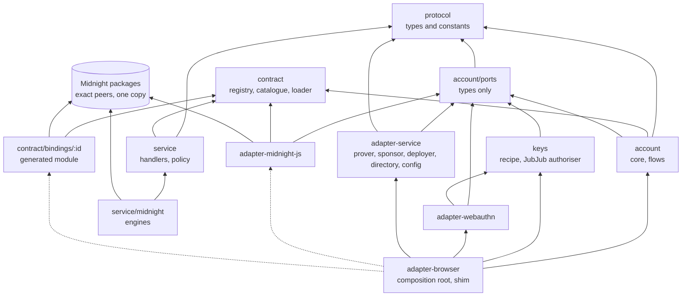

# Passport SDK packages: a publishing design

> **Status:** draft for review · 2026/10/07 · design only; nothing here is built. Every decision
> marked **[PROPOSED]** awaits the owner. Decisions that change a source doc (`architecture.md`,
> `CLAUDE.md`, `compatibility.md`) land through `doc-sync` with an ADR before any tranche is
> planned.
> **Inputs:** [`docs/prototype/architecture.md`](../../prototype/architecture.md) (the deviations,
> cited here as A-1 to A-13), the SDK realignment proposal (2026-09-25) and the proposal's package
> map, [FS-0.9](../../roadmap/specs/M0-Foundations/FS-0.9-acc-artefact-package.md), the
> [prototype spec](./2026-10-06-passport-dapp-design.md), the experiments in
> [`experiments/acc-0.35/`](../../../experiments/acc-0.35/README.md), and
> [lace-platform](https://github.com/input-output-hk/lace-platform) `main` at `5c8022c7a`.
> **Issues:** [#17](https://github.com/input-output-hk/midnight-passport-sdk/issues/17) (progress),
> [#20](https://github.com/input-output-hk/midnight-passport-sdk/issues/20) (on-chain directory),
> [#23](https://github.com/input-output-hk/midnight-passport-sdk/issues/23) (pre-deployed accounts),
> [#24](https://github.com/input-output-hk/midnight-passport-sdk/issues/24) (two authoriser arms),
> [#25](https://github.com/input-output-hk/midnight-passport-sdk/issues/25) (virtual-authenticator
> test). The stack configuration as URLs has no fork issue yet (see section 9).

## 0. Goal, principles and decisions

**Goal.** Turn what the prototype proved into packages that a production service can embed:
lace-platform first, any other wallet host or backend after it. The SDK owns the contract: the
ports, the account API, the error codes, the progress events, the service's wire format and the
contract binding. It should also be generic and small enough at each seam that a host adopts it
because that is less work than keeping its own.

**Principles.**

1. **Ports and adapters.** The account core depends only on interfaces it declares (dependency
   inversion). Every key, network and storage dependency is an adapter; a new authoriser arm or a
   new sponsor is a new adapter, with no change to the core (open–closed).
2. **One reason to change per package** (single responsibility); **small ports** (interface
   segregation); **every adapter passes its port's contract suite** (substitution).
3. **Platform-neutral by default.** Browser code and Node code live in named adapters; the core,
   the protocol and the key recipe run anywhere JavaScript runs.
4. **Nothing heavy on the entry path.** Only three places import Midnight runtime code, and a host
   reaches them through `import()`. Midnight packages are exact peer dependencies, so a host keeps
   one physical copy of each.
5. **No module-global state.** Everything is instance-scoped; midnight-js's process-wide network id
   is set per operation, not at construction.
6. **Promises and callbacks at the boundary.** Hosts wrap them in whatever they use (lace-platform
   turns them into observables, its ADR 19).
7. **The ledger is authoritative.** Any off-chain hint (directory, local record, `/config`) is
   checked against the chain before it is used.
8. **Secrets stay in key sources.** Ports carry public keys, signatures and named derivations,
   never a seed, a root or a PRF output.
9. **Typed.** No `any`; `unknown` only where a comment names why and who owns the type.

**Decisions.**

| #    | Decision                                                                                                                                                                                                                                                       | Why                                                                                                                                                                                                                                    |
| ---- | -------------------------------------------------------------------------------------------------------------------------------------------------------------------------------------------------------------------------------------------------------------- | -------------------------------------------------------------------------------------------------------------------------------------------------------------------------------------------------------------------------------------- |
| D-1  | **[PROPOSED]** Publish as `@input-output-hk/mn-passport-*` on GitHub Packages, from a fork-only manual workflow. All packages share one version (lockstep).                                                                                                    | GitHub Packages scopes names to the owning organisation (FS-0.9 D-10). One version makes the compatibility matrix one row per release.                                                                                                 |
| D-2  | **[PROPOSED]** Ports live in `mn-passport-account` under a types-only `./ports` subpath. Adapters import that subpath and nothing else from the account package.                                                                                               | The proposal puts the shared seams in `mn-passport-account`. The subpath gives adapters and hosts the interfaces without the flows.                                                                                                    |
| D-3  | **[PROPOSED]** The account owner's flows (create, open, rotate, add and remove device) live in `mn-passport-account`, not in `core`.                                                                                                                           | A wallet host such as Lace runs them, not only the Passport app. lace-platform's flow layer is already plain functions that "could move upstream unchanged". The proposal's open question 15 asks the same for onboarding from a dApp. |
| D-4  | **[PROPOSED]** Where a port means what a lace-platform seam means, it uses the same member names and accepts a superset of the same shapes, so an existing lace-platform object satisfies it without glue.                                                     | Adoption by assignment, not by adapter. The SDK still owns the definition and can extend it.                                                                                                                                           |
| D-5  | **[PROPOSED]** Proving is transaction-level: `Prover.proveTx`. A circuit-level prover joins through a bridge. The service's `/prove` and `/check` retire.                                                                                                      | midnight-js 5 resolves prover keys on the client before a per-circuit prove (A-1); the 52-circuit ACC has 12.2 GB of prover keys.                                                                                                      |
| D-6  | **[PROPOSED]** Midnight packages are exact `peerDependencies`, imported only by `mn-passport-contract/bindings/*`, `mn-passport-adapter-midnight-js` and `mn-passport-service/midnight`. A build check refuses a static Midnight import anywhere else.         | One copy per host (the prototype's two-runtimes failure), and lace-platform's rule that Midnight code is reached only through `import()` (its ADR 30).                                                                                 |
| D-7  | **[PROPOSED]** Two authoriser arms behind one port (#24): P-256 WebAuthn and JubJub from PRF output #1. P-256 is the default where the relying party's origin fits the contract's WebAuthn profile; otherwise JubJub.                                          | Owner direction on 2026/10/07; the `wa-json134` profile binds a 21-byte origin, and Lace's hosted relying party is 23 bytes (A-6, architecture section 4.2).                                                                           |
| D-8  | **[PROPOSED]** The prototype's "DApp Connector API" becomes the **account API** v1: the account owner's surface, versioned in `mn-passport-protocol`. The dApp-facing connection remains the grant ceremony, a separate later surface.                         | A-8: its operations are the Passport app's, not a dApp's.                                                                                                                                                                              |
| D-9  | **[PROPOSED]** Progress is a typed event with three phases over a closed list of steps. The service reports its share through jobs that the client polls.                                                                                                      | #17. Polling matches lace-platform's request-and-poll rule for long work (its ADRs 41 and 51) and survives proxies and service-worker hosts.                                                                                           |
| D-10 | **[PROPOSED]** The service is a library of framework-agnostic handlers (`Request` in, `Response` out) over injectable engines, stores and a sponsor policy rule set, with a reference `node:http` server. `apps/passport-service` becomes a composition of it. | A production operator mounts what it needs in its own server, and swaps the sponsor rules without forking.                                                                                                                             |
| D-11 | **[PROPOSED]** Retiring the maintenance authority is an explicit, required choice at create, with no default.                                                                                                                                                  | It is irreversible (spec Q1); lace-platform already requires `lockAccount`.                                                                                                                                                            |
| D-12 | **[PROPOSED]** Finding an account goes through an `AccountDirectory` port whose answers the core always verifies. HTTP now, an on-chain registry next (#20).                                                                                                   | A-4. The verification is the security property, not the source.                                                                                                                                                                        |

## 1. Package set and responsibilities

### 1.1 The packages

Every package is published as `@input-output-hk/mn-passport-<name>`; the directory names under
`packages/` stay as they are. Today they are named `@midnight-ntwrk/mn-passport-*`, private and
unpublished.

| Package               | Single responsibility                                                                                                                                                                                                                                                              | Platform                                                     | Depends on (`mn-passport-*`)                                                                                                             | External peers                                                                                                                                                      |
| --------------------- | ---------------------------------------------------------------------------------------------------------------------------------------------------------------------------------------------------------------------------------------------------------------------------------- | ------------------------------------------------------------ | ---------------------------------------------------------------------------------------------------------------------------------------- | ------------------------------------------------------------------------------------------------------------------------------------------------------------------- |
| `protocol`            | The SDK's versioned contracts: account API types, the `window.midnight.passport` descriptor, error codes, progress events, the service's HTTP wire types, version constants. Types and constants only.                                                                             | Neutral                                                      | none                                                                                                                                     | none                                                                                                                                                                |
| `contract`            | The ACC artefact: per binding, the generated module and types, contract info, compiler manifest, ZKIR and verifier keys; the binding registry, a per-arm circuit catalogue, the integrity loader and the ledger projection. No prover keys.                                        | Neutral; `./bindings/*` needs the Compact runtime            | none                                                                                                                                     | `@midnight-ntwrk/compact-runtime`, exact, for `./bindings/*` only                                                                                                   |
| `account`             | The account core: ports (`./ports`), the flows, arm-aware challenge assembly through the binding's pure circuits, the use-counter scan, directory verification, the deploy planner, error mapping and event emission; `./testing` with fakes and the port contract suites.         | Neutral, no Midnight import                                  | `protocol`; `contract` (registry, catalogue and types, no bindings)                                                                      | none                                                                                                                                                                |
| `keys`                | Key providers that need no platform API: the Lace key recipe v1 as pure functions, an `EncryptionKeySource` and a JubJub `Authoriser` built over any `PrfKeySource`.                                                                                                               | Neutral                                                      | `account/ports`                                                                                                                          | none (depends on `@noble/curves`, `@noble/hashes`, `@scure/bip39`)                                                                                                  |
| `adapter-webauthn`    | The browser's WebAuthn API: a `CredentialPort` and a `PrfKeySource` over `navigator.credentials` (create with PRF, discoverable identify with proof of ownership, pinned ceremonies, the create-time PRF hold) and the P-256 `Authoriser` under `wa-json134`.                      | Browser                                                      | `account/ports`, `keys` (salts only)                                                                                                     | none                                                                                                                                                                |
| `adapter-midnight-js` | The `Chain` port over midnight-js 5: call assembly, ledger reads through the indexer, finality, artefact loading with the manifest pin. Turns the `Prover`, `FeeSponsor` and `Submitter` ports into midnight-js providers; offers `circuitProverBridge` for circuit-level provers. | Browser and Node; reached through `import()`                 | `account/ports`, `contract`                                                                                                              | midnight-js 5 (`contracts`, `types`, `indexer-public-data-provider`, `fetch-zk-config-provider`, `network-id`), `compact-js`, `compact-runtime`, `ledger-v9`, exact |
| `adapter-service`     | HTTP clients for the Passport service, one subpath per port: `./prover`, `./sponsor` (`FeeSponsor` and `Submitter`), `./deployer`, `./directory`, `./config`. They share the wire types and the status-to-code mapping.                                                            | Neutral (`fetch`)                                            | `account/ports`, `protocol`                                                                                                              | none                                                                                                                                                                |
| `adapter-browser`     | The browser composition root: `createBrowserPassport(config)` wires the adapters above, loads the chain lazily, and `injectPassportConnector` installs the descriptor. Optional; a host such as Lace composes its own.                                                             | Browser                                                      | `account`, `protocol`, `keys`, `adapter-webauthn`, `adapter-service`; `adapter-midnight-js` and `contract/bindings/*` through `import()` | through `adapter-midnight-js`                                                                                                                                       |
| `service`             | The Passport service as a library: handlers for the artefact host, prover, sponsor, deployer, directory and config; their engine and store ports; the sponsor policy rule set; request guards. `./midnight` holds the engines, `./node` the reference server and file stores.      | Handlers on any `fetch` runtime; `./midnight`, `./node` Node | `protocol`, `contract`                                                                                                                   | `./midnight`: midnight-js 5, the wallet SDK, `ledger-v9`, exact                                                                                                     |

The proposal's `adapter-prover-remote` and `adapter-broadcast` are `adapter-service/prover` and
`adapter-service/sponsor`. They share one wire and one error mapping, so they start as subpaths of
one package; they become packages of their own when a second backend for one of them appears.

**Reserved, not specified here** (the proposal's later work): `core`, `connect`, `agent`,
`adapter-fee-capacity-exchange`, `adapter-prover-wasm`, `adapter-nodejs`, `adapter-storage-wpp`,
`adapter-recovery`, `adapter-did` and the dApp-code registry. `core` will compose `account` and add
the Passport app's own concerns (grant issuance, WPP, recovery, DID). **Retired:** the empty
`adapter-signer-local` and `adapter-signer-managed`, which the proposal folds into key providers,
and the empty `adapter-prover-remote` directory, replaced by `adapter-service/prover`.

### 1.2 Dependency graph

Arrows read "depends on". Dashed arrows are `import()` only. There are no cycles: `protocol` and
`contract` depend on nothing, `account` only on them, and every adapter only on `account/ports`
plus, where noted, `contract` or `keys`.



`scripts/dependency-graph.mjs` gains these edges, and `scripts/lint-boundaries.mjs` three rules:
an adapter imports `@input-output-hk/mn-passport-account/ports` and never the account root; only
the three Midnight-facing entry points import `@midnight-ntwrk/*` or the ledger and wallet
packages; `protocol`, `account`, `keys` and `adapter-service` import no `node:` built-in. A
post-build scan of each package's `dist/` repeats the second rule on the output, as lace-platform's
SDK build does.

### 1.3 Public API, indicatively

Signatures are fixed when each tranche is specced; these show the shape and what each package
exports.

```ts
// @input-output-hk/mn-passport-protocol: types and constants only
export const PASSPORT_API_VERSION = '1.0.0';
export const PASSPORT_SERVICE_API_VERSION = '1.0.0';
export type { PassportConnectorDescriptor, PassportConnectorAPI, PassportAccount } from './api.js';
export type { PassportErrorCode, PassportErrorShape } from './errors.js';
export type { PassportEvent, PassportStep } from './events.js';
export type * as ServiceWire from './service.js';

// @input-output-hk/mn-passport-contract
export const BINDINGS: BindingRegistry; // id → manifest hash, toolchain, runtime, arms, roster
export function resolveBinding(id: string): BindingInfo;
export function circuitFor(
  binding: BindingInfo,
  operation: AccOperation,
  scheme: AuthScheme,
): string;
export function verifyArtefact(
  binding: BindingInfo,
  path: string,
  bytes: Uint8Array,
): Promise<void>;
// @input-output-hk/mn-passport-contract/bindings/<id>: imports the Compact runtime
export const binding: AccBinding; // { info, Contract, ledger, pureCircuits }

// @input-output-hk/mn-passport-account
export function createPassportAccounts(ports: PassportPorts): PassportConnectorAPI;
export function planDeploy(binding: BindingInfo, options: DeployPlanOptions): DeployPlan;
export { PassportError, toPassportError } from './errors.js';
// ./ports: the interfaces of section 2; ./testing: fakes and contract suites

// @input-output-hk/mn-passport-keys
export const RECIPE_V1: { prfSalts; hkdfWalletEntropyInfo; accEncDomain };
export function recipeEncryptionKey(source: PrfKeySource): EncryptionKeySource;
export function jubjubPrfAuthoriser(opts: {
  source: PrfKeySource;
  binding: Lazy<AccBinding>;
}): Authoriser;

// @input-output-hk/mn-passport-adapter-webauthn
export function webauthnPasskey(opts: {
  rpId: string;
  origin: string;
  credentials?: CredentialsContainer;
}): {
  credentials: CredentialPort;
  prf: PrfKeySource;
  p256: Authoriser;
};

// @input-output-hk/mn-passport-adapter-midnight-js
export function createMidnightChain(opts: {
  network: NetworkConfig;
  binding: AccBinding;
  prover: Prover;
  sponsor: FeeSponsor;
  submitter: Submitter;
}): Chain;
export function circuitProverBridge(prover: CircuitProver, keys: KeyMaterialResolver): Prover;

// @input-output-hk/mn-passport-adapter-service/{prover,sponsor,deployer,directory,config}
export function remoteProver(base: string, opts?: RemoteOptions): Prover;
export function remoteSponsor(base: string, opts?: RemoteOptions): FeeSponsor & Submitter;
export function remoteDeployer(base: string, opts?: RemoteOptions): Deployer;
export function remoteDirectory(base: string, opts?: RemoteOptions): AccountDirectory;
export function fetchCheckedConfig(base: string, pin: NetworkConfig): Promise<ServiceWire.Config>;

// @input-output-hk/mn-passport-adapter-browser
export function createBrowserPassport(config: BrowserPassportConfig): PassportConnectorAPI;
export function injectPassportConnector(
  target: WindowLike,
  descriptor: PassportConnectorDescriptor,
): void;

// @input-output-hk/mn-passport-service
export function createPassportService(opts: PassportServiceOptions): PassportService; // { handle, close }
export {
  artefactHost,
  proverService,
  sponsorService,
  deployerService,
  directoryService,
} from './components.js';
export { sponsorPolicy, rules as sponsorRules, deployPolicy, deployRules } from './policy.js';
// ./midnight: proofServerEngine, walletSponsor, waveDeployer; ./node: serve, fileDirectoryStore
```

### 1.4 The contract artefact package

`mn-passport-contract` carries, for each supported binding: the generated module (`index.js`,
`index.d.ts`, source map), `contract-info.json`, the compiler's `contract-manifest.json`, ZKIR in
text and binary form, the verifier keys and the `.compact` source (FS-0.9 D-3; OQ-7 asks whether a
curated interface replaces the source). It carries **no prover keys**.

Why, from the experiments:

| Measurement                                                                   | Value                                                    | Source             |
| ----------------------------------------------------------------------------- | -------------------------------------------------------- | ------------------ |
| Client set (module, types, contract info, manifest, verifier keys, source)    | 0.18 MB packed, 1.83 MB unpacked                         | X2                 |
| Client set with ZKIR                                                          | 0.28 MB packed, 2.88 MB unpacked                         | X2                 |
| Everything with prover keys, 36-circuit build                                 | 1,177 MB packed, 5,051 MB unpacked                       | X2                 |
| Prover keys, 52-circuit build `acc-45721e1`                                   | 12,175.5 MB; the largest 495.0 MB                        | X6                 |
| Single keys above GitHub Packages' 256 MB per-version limit, 52-circuit build | 15                                                       | spec §2            |
| Our build against the contract team's, 52-circuit build                       | 162 of 162 ZKIR and key hashes identical                 | X6                 |
| Prover keys rebuilt from ZKIR alone                                           | script exists (`regen-check.sh`); no recorded result yet | experiments README |

The measurements of the client set are for the 36-circuit build; the first tranche of FS-0.9
measures the 52-circuit build and sets the package's size budget from it. Prover keys travel as a
separate bundle per binding, verified by the same manifest, or are rebuilt from ZKIR by the prover
(FS-0.9 D-4, OQ-6). The generated module imports `@midnight-ntwrk/compact-runtime` as a peer, so it
resolves the host's single copy: the prototype's copy step (`sync-acc.mjs`) and its build-time hash
variable go away, because the package version pins the manifest hash.

## 2. Ports and adapters

### 2.1 The ports

The account core consumes the first group; the `Chain` adapter consumes the second. Both are
declared in `mn-passport-account/ports`.

```ts
// Core-facing ports
export type AuthScheme = 'p256-webauthn' | 'jubjub-schnorr' | 'k256-ecdsa';

export interface Authoriser {
  readonly scheme: AuthScheme;
  devicePublicKey(): Promise<CurvePoint>; // P-256 or JubJub point
  /** WebAuthn binding for the P-256 arm: the policy and the credential the key lives in. */
  deviceBinding?(): Promise<{ policy: WebAuthnPolicy; credentialId: Uint8Array }>;
  /** Signs one call. `challenge` is the digest from the binding's pure circuits, or a builder for JubJub's grinding. */
  authorise(request: AuthorisationRequest): Promise<Authorisation>;
  /** Optional batch, so an interactive key source prompts once for a counter scan. */
  deviceCommitments?(
    account: string,
    epoch: bigint,
    counters: readonly bigint[],
  ): Promise<string[]>;
  /** Optional: one ceremony for a whole flow. */
  withKeySession?<T>(operation: () => Promise<T>, flow?: FlowDescriptor): Promise<T>;
}

export interface AuthorisationRequest {
  readonly account: string;
  readonly circuit: string;
  readonly args: readonly unknown[]; // the circuit's arguments; `unknown` because the binding owns their types
  readonly witnessValues: readonly unknown[];
  readonly authNonce: bigint;
  readonly useCounter: bigint;
  readonly challenge: Uint8Array | ChallengeBuilder;
}

export interface CredentialPort {
  create(user: { name: string }): Promise<CredentialRef>;
  /** Discoverable prompt; `owns` verifies the same assertion under a candidate key, with no second prompt. */
  identify(): Promise<{
    credentialId: Uint8Array;
    owns(key: CurvePoint, policy?: WebAuthnPolicy): boolean;
  }>;
}

export interface EncryptionKeySource {
  publicKey(networkId: string): Promise<Uint8Array>; // X25519 public key, the ACC's enc_key
}

export interface Chain {
  call(request: CallRequest): Promise<TxResult>;
  readAccount(address: string): Promise<AccLedgerView | undefined>;
}

export interface Deployer {
  deploy(request: DeployRequest): Promise<{ address: string; txIds: readonly string[] }>;
}

export interface AccountDirectory {
  get(networkId: string, key: DirectoryKey): Promise<AccountHint | undefined>;
  put(networkId: string, hint: AccountHint, proof?: OwnershipProof): Promise<void>;
}

export interface AccountRecordStore {
  read(): Promise<AccountRecord | undefined>;
  write(record: AccountRecord): Promise<void>;
  exists(): Promise<boolean>;
}

export interface NetworkConfig {
  readonly networkId: string;
  readonly indexerUrl: string;
  readonly indexerWsUrl: string;
  readonly nodeUrl: string;
  readonly artefactUrl: string;
  readonly bindingId: string;
  readonly manifestSha256: string;
}

export type Lazy<T> = T | (() => Promise<T>);

export interface PassportPorts {
  readonly network: NetworkConfig;
  readonly binding: Lazy<AccBinding>;
  readonly credentials: CredentialPort;
  readonly authoriser: Authoriser;
  readonly encryptionKey: EncryptionKeySource;
  readonly chain: Lazy<Chain>;
  readonly deployer: Deployer;
  readonly directory?: AccountDirectory;
  readonly records?: AccountRecordStore;
  readonly random?: (length: number) => Uint8Array;
}

// Chain-facing ports
export interface PrfKeySource {
  withSession<T>(operation: () => Promise<T>): Promise<T>;
  deviceSecret(): Promise<Uint8Array>; // PRF output #1; the caller zeroes it
  deriveSecret(params: { domain: string; context: string; length?: number }): Promise<Uint8Array>; // MIP-0015 under the root
}

export interface Prover {
  proveTx(
    unproven: Uint8Array,
    context: ProveContext,
  ): Promise<{ tx: Uint8Array; provenance: 'remote' | 'local' }>;
}

export interface FeeSponsor {
  balanceAndSign(unbalancedTx: Uint8Array): Promise<Uint8Array>;
}

export interface Submitter {
  submit(finalisedTx: Uint8Array): Promise<string>; // the submission id
}
```

Storage is two ports with different jobs: `AccountRecordStore` is this device's memory of its
account (an anchor counter, the binding id), and `AccountDirectory` is cross-device discovery. The
private-state provider of the proposal (`PrivateStateProvider`, WPP) joins `./ports` when grants
and dApp private data arrive; nothing in this design needs it.

`Prover.proveTx` returns where the proof ran, so a host can tell the user, as the proposal's amended
rule asks: a remote prover sees the coin and the amount, and the user is told so (A-12).

The supporting types (`CurvePoint`, `WebAuthnPolicy`, `ChallengeBuilder`, the arm-tagged
`Authorisation` union, `CallRequest`, `TxResult`, `DeployRequest`, `DirectoryKey`, `AccountHint`,
`OwnershipProof`, `AccountRecord`, `AccBinding`, `ProveContext`, `FlowDescriptor`) are fixed in
tranche T2. Ports are declared with method syntax, so a host's object whose parameters use branded
types (lace-platform's `AccAddress`, `UseCounter`) still fits.

### 2.2 Adapters, and how each swaps

| Port                  | Default adapter                             | Alternatives                                                                              | lace-platform seam it maps to                                                                      |
| --------------------- | ------------------------------------------- | ----------------------------------------------------------------------------------------- | -------------------------------------------------------------------------------------------------- |
| `Authoriser`          | `adapter-webauthn` P-256 (`wa-json134`)     | `keys` `jubjubPrfAuthoriser` (#24); a remote signer                                       | `PassportAuthoriser` (`@lace-contract/passport`)                                                   |
| `CredentialPort`      | `adapter-webauthn`                          | a software credential for tests and Node                                                  | `PasskeyKeySource.ensureCredential`, plus the example app's discoverable "select existing passkey" |
| `PrfKeySource`        | `adapter-webauthn`                          | any key source with these three members; a remote signer page's                           | `PasskeyKeySource` (`@lace-lib/passkey`); the signer page's remote key source                      |
| `EncryptionKeySource` | `keys` `recipeEncryptionKey(prf)`           | the host's                                                                                | `PassportEncryptionKey`                                                                            |
| `Chain`               | `adapter-midnight-js` `createMidnightChain` | the host's own pipeline                                                                   | the module's `infra/providers.ts` and `infra/submit.ts`                                            |
| `Prover`              | `adapter-service/prover` (`/prove-tx`)      | `circuitProverBridge` over a circuit-level prover; in-tab proving later                   | `PassportProver`, through the bridge                                                               |
| `FeeSponsor`          | `adapter-service/sponsor`                   | Capacity Exchange later; any sponsor with `balanceAndSign`                                | `FeeSponsor` (`balanceAndSign`): the same member and contract                                      |
| `Submitter`           | `adapter-service/sponsor`                   | midnight-js's node provider; a substrate relay                                            | the module's node relay (`infra/node-relay.ts`)                                                    |
| `Deployer`            | `adapter-service/deployer` (a service job)  | a client-side deploy over `Chain` and `planDeploy`; a pool of pre-deployed accounts (#23) | the module's `acc/deploy.ts`                                                                       |
| `AccountDirectory`    | `adapter-service/directory` (`/accounts`)   | an on-chain registry (#20); the passkey's `largeBlob`; a WaaS provider's metadata         | none (lace-platform's A6 is open)                                                                  |
| `AccountRecordStore`  | in memory                                   | the host's storage, sealed by the host                                                    | `AccountRecords` / `AccountRecordStore`                                                            |
| `NetworkConfig`       | a value                                     | none                                                                                      | `PassportNetworkConfig`, plus `bindingId` and `manifestSha256`                                     |
| progress (`onEvent`)  | none                                        | the host's sink                                                                           | `FlowProgress`, by the mapping in section 3.4                                                      |

**How lace-platform plugs in its own sponsor, prover and passkey key source, without forking:**

- **Sponsor.** Its `FeeSponsor` already has `balanceAndSign(unbalancedTx: Uint8Array):
Promise<Uint8Array>`; it is passed as is to `createMidnightChain({ sponsor })`. Its node relay
  becomes the `Submitter` with a one-line wrapper around its submit function.
- **Prover.** Two choices. Keep its proof server and circuit-level `PassportProver`:
  `circuitProverBridge(passportProver, keyMaterialResolver)` returns a `Prover` that proves the
  transaction in-process, calling the circuit-level prover for each circuit as midnight-js does
  today. Or point `remoteProver` at a hosted Passport service, which is the only workable route for
  the 52-circuit binding in a browser.
- **Passkey key source.** Its `PasskeyKeySource` has `withSession`, `deviceSecret` and
  `deriveSecret({ domain, context })`, so it satisfies `PrfKeySource` by assignment.
  `recipeEncryptionKey(keySource)` then equals its `createPasskeyEncryptionKey(keySource)`, and
  `jubjubPrfAuthoriser({ source: keySource, binding })` is the SDK's JubJub authoriser. Or it keeps
  its own `PassportAuthoriser`: `scheme`, `devicePublicKey`, `deviceCommitments`, `authorise` and
  `withKeySession` are the port's names, its `AuthorisationRequest` fields are a subset of the
  port's, and its JubJub `Authorisation` is one arm of the port's union. The remote signer page's
  authoriser plugs in the same way, which keeps its per-flow scoping: the request still names the
  circuit and arguments. A compile-time test in `account/testing` holds the SDK to this: it assigns
  objects of lace-platform's published seam shapes, copied as fixtures, to the ports.

The one place glue remains is the account record: lace-platform's record holds `bindingVersion`
and `localUseCounter`; the SDK's adds the scheme and the credential id. A host maps one onto the
other in a few lines.

## 3. The account API contract

The SDK owns this contract; hosts implement or inject it, and consumers call it.

### 3.1 The descriptor

A host that offers Passport to a page installs a frozen descriptor at `window.midnight.passport`,
as the Midnight DApp Connector convention does for wallets:

```ts
export interface PassportConnectorDescriptor {
  readonly rdns: string; // reverse-DNS id of the host, for example 'io.lace.passport'
  readonly name: string;
  readonly icon?: string; // a data URI
  readonly apiVersion: string; // the PASSPORT_API_VERSION the host implements
  readonly bindings: readonly string[]; // binding ids the host can open; the first is the one it deploys
  connect(networkId: string, options?: { apiVersion?: string }): Promise<PassportConnectorAPI>;
}
```

`options.apiVersion` is a semver range the caller accepts; a host that cannot satisfy it refuses
with `ApiVersionUnsupported`. The descriptor is one transport. A host that embeds the SDK directly
calls `createPassportAccounts(ports)` and never touches `window`.

### 3.2 The API

```ts
export interface FlowOptions {
  readonly signal?: AbortSignalLike;
  readonly onEvent?: (event: PassportEvent) => void;
}

export interface CreateAccountOptions extends FlowOptions {
  readonly userName: string;
  readonly retireAuthority: boolean; // required, no default (D-11)
  /** @deprecated since 1.0.0: use onEvent. Removed in 2.0.0. */
  readonly onProgress?: (step: CreateAccountStep) => void;
}

export interface PassportConnectorAPI {
  readonly apiVersion: string;
  readonly networkId: string;
  readonly bindingId: string; // the binding new accounts are deployed from
  createAccount(options: CreateAccountOptions): Promise<PassportAccount>;
  openAccount(options?: FlowOptions): Promise<PassportAccount>;
}

export interface PassportAccount {
  readonly address: string;
  readonly networkId: string;
  readonly bindingId: string;
  readonly scheme: AuthScheme;
  readonly credentialId?: Uint8Array; // passkey-backed arms; later ceremonies pin to it
  state(): Promise<PassportAccountState>;
  rotateEncryptionKey(newKey: Uint8Array, options?: FlowOptions): Promise<PassportTxResult>;
  // Added in 1.x minors: devices(), addDevice(), removeDevice().
}
```

Against the prototype's `0.1.0-prototype`: `retireAuthority` and `scheme` are new, `onEvent` and
`signal` are new, `onProgress` survives as a deprecated wrapper, and the descriptor gains `rdns`,
`icon` and `bindings`.

### 3.3 Error codes

Every error is `{ type: 'PassportConnectorError', code, message, step?, retryable, cause? }`.
`step` names the progress step that failed, so "Failed: …" can say where.

| Code                       | Meaning                                                                       | Retryable | Prototype                           | lace-platform                                   |
| -------------------------- | ----------------------------------------------------------------------------- | --------- | ----------------------------------- | ----------------------------------------------- |
| `UserCancelled`            | The passkey prompt was dismissed or aborted                                   | yes       | same                                | `ceremony-cancelled`                            |
| `UnsupportedAuthenticator` | No ES256 key, a probe outside the profile, or no PRF                          | no        | same                                | `prf-unsupported`                               |
| `WrongPasskey`             | A ceremony pinned to the account's credential was answered by another passkey | yes       | `AccountNotFound` (`WRONG_PASSKEY`) | `PasskeyCredentialMismatchError`                |
| `AccountNotFound`          | No account this passkey can open on this network                              | no        | same                                | `account-not-found`, `account-contract-missing` |
| `EncryptionKeyMismatch`    | The derived `enc_key` differs from the contract's                             | no        | not checked                         | `encryption-key-mismatch`                       |
| `NotAuthorised`            | The contract refused the authorisation                                        | no        | `InternalError`                     | `not-authorised`                                |
| `DeviceEntryNotFound`      | No live entry for this device within the scanned counters                     | no        | `AccountNotFound`                   | `device-entry-not-found`                        |
| `BindingUnsupported`       | The account's binding is not one this SDK release can operate                 | no        | none                                | none                                            |
| `ArtefactIntegrity`        | An artefact or manifest does not match its pin                                | no        | same                                | `artefact-integrity`                            |
| `ProverUnavailable`        | The prover failed, is full or timed out                                       | yes       | same                                | `proof-server`                                  |
| `SponsorRejected`          | The sponsor refused by policy, cap or budget                                  | maybe     | same                                | `sponsor-exhausted`                             |
| `NetworkMismatch`          | The service or the account is on another network                              | no        | same                                | none                                            |
| `ApiVersionUnsupported`    | The host cannot satisfy the caller's API range                                | no        | none                                | none                                            |
| `Aborted`                  | The caller's `signal` aborted the flow                                        | yes       | none                                | none                                            |
| `InternalError`            | Anything else; a defect                                                       | no        | same                                | anything else                                   |

`toPassportError` recognises lace-platform's error objects by their `code` property, so errors that
a lace-platform adapter throws arrive under the right code. Consumers treat an unknown code as
`InternalError`; that rule is what lets a minor release add codes.

### 3.4 Progress events (#17)

```ts
export type PassportStep =
  | 'passkey.create'
  | 'passkey.probe'
  | 'passkey.prf'
  | 'passkey.identify'
  | 'passkey.sign'
  | 'service.config'
  | 'deploy'
  | 'deploy.wave'
  | 'deploy.retire'
  | 'activate'
  | 'prove'
  | 'prove.queue'
  | 'sponsor.balance'
  | 'sponsor.submit'
  | 'chain.finality'
  | 'chain.read'
  | 'counter.scan'
  | 'directory.read'
  | 'directory.write';

export interface PassportEvent {
  readonly id: string; // one step instance; its start and its end share the id
  readonly flowId: string;
  readonly step: PassportStep;
  readonly phase: 'start' | 'end' | 'error';
  readonly at: number; // milliseconds since the epoch
  readonly clock: 'client' | 'service'; // which side stamped it
  readonly durationMs?: number; // on end and error
  readonly detail?: {
    wave?: number;
    of?: number;
    queuePosition?: number;
    circuit?: string;
    txId?: string;
  };
  readonly error?: { code: PassportErrorCode; message: string };
}
```

Rules: every `start` has exactly one `end` or `error` with the same id; events carry no secret;
consumers ignore steps they do not know. The service stamps its own events and the client re-emits
them with `clock: 'service'`.

The service reports through jobs. `POST /v1/deploy` and `POST /v1/prove-tx` answer `202 { jobId }`;
`GET /v1/jobs/{jobId}?after={cursor}` answers `{ state, events, cursor, result?, error? }` with
`state` one of `queued`, `running`, `done` or `failed`. `adapter-service` polls and re-emits. A
proof waiting behind a deploy therefore reports its queue position instead of looking frozen.
Server-Sent Events can be added later as a second transport for the same events.

Mapping onto lace-platform's `FlowStage`: `deploy*` → `deploying`, `prove*` → `proving`,
`sponsor.*` → `sponsoring`, `activate` → `activating`. The other steps have no Lace stage and can
be dropped or shown.

### 3.5 Compatibility policy: two axes

| Axis    | What it versions                                                                                                                                          | Where                                                          | Breaking change means                                                                               |
| ------- | --------------------------------------------------------------------------------------------------------------------------------------------------------- | -------------------------------------------------------------- | --------------------------------------------------------------------------------------------------- |
| API     | The account API, descriptor, error codes and events (`PASSPORT_API_VERSION`); the service's HTTP wire (`PASSPORT_SERVICE_API_VERSION`, path prefix `/v1`) | `mn-passport-protocol`                                         | A removed or changed member, field, code meaning or endpoint                                        |
| Binding | The deployed ACC's circuit shape: binding id, manifest hash, Compact runtime                                                                              | `mn-passport-contract` registry; `mn-passport-account` support | Dropping a binding, or moving the Compact runtime (all bindings in a release share one, FS-0.9 D-6) |

- **Semantic versioning.** All packages share one version (D-1). A major bump on either axis is a
  major release. A minor release may add: optional fields, methods, error codes, progress steps,
  endpoints and bindings. A patch changes no contract.
- **Binding ids** follow FS-0.9 D-5 (`acc-s<spec_version>r<recovery_version>.<n>`); the prototype's
  `acc-45721e1` gets the first id of that scheme when FS-0.9 re-pins it.
- **Forward compatibility.** Consumers ignore unknown fields and steps and map unknown codes to
  `InternalError`; hosts refuse a caller's API range they cannot meet.
- **Before 1.0.** Releases are `0.y.z`; a minor may break, a patch may only add. 1.0.0 is cut when
  lace-platform integrates.
- **The matrix.** [`docs/compatibility.md`](../../compatibility.md) gains one row per release: SDK
  version, API version, service API version, supported bindings, the binding new accounts use,
  Compact runtime, and the Midnight package set.

### 3.6 Deprecation

- A deprecated member carries `@deprecated` with the version and its replacement, and a changelog
  entry. It stays for at least two minor releases and 90 days, and is removed only in a major.
- The library never writes to the console. A host that wants to hear about deprecated use passes
  `onDeprecation`, called once per member per instance.
- An old service API major is served beside the new one, under its own path prefix, for at least
  90 days; `/config` lists the versions served.
- **Bindings.** A binding first stops being the one new accounts use; it stays openable and
  operable while accounts on it can exist. An account whose maintenance authority is retired can
  never be upgraded, so a binding with live accounts is dropped only when a migration flow exists,
  in a major release announced one release ahead in the matrix.

## 4. Service components

### 4.1 Shape

`mn-passport-service` turns the prototype's service into components that a production operator
mounts in its own server.

```ts
type PassportHandler = (request: Request) => Promise<Response | undefined>; // undefined: not mine

const service = createPassportService({
  networkId: 'undeployed',
  bindings: [binding.info], // from mn-passport-contract
  artefacts: contractPackageArtefacts(), // serves the client set from the installed package
  prover: {
    engine: proofServerEngine({ url, proverKeys }),
    queue: { maxQueued: 8, timeoutMs: 900_000 },
  },
  sponsor: { wallet: walletSponsor({ seed }), policy: sponsorPolicy(...sponsorRules.prototype) },
  deployer: { engine: waveDeployer({ wallet }), policy: deployPolicy(deployRules.cap(20)) },
  directory: { store: fileDirectoryStore(path) },
  jobs: memoryJobStore(),
  guards: { hosts, corsOrigins, authenticate, rateLimit },
});
serve(service.handle, { host: '127.0.0.1', port: 8787 }); // ./node, the reference server
```

Each component also exists on its own (`artefactHost`, `proverService`, `sponsorService`,
`deployerService`, `directoryService`), so an operator can run the prover on a GPU host and the
sponsor elsewhere. A handler takes a WHATWG `Request` and answers a `Response`: Node 22, Bun, Deno,
Cloudflare Workers and Hono run it directly, and Express or Fastify need one adapter function. The
Midnight engines in `./midnight` need Node.

| Component     | Endpoints                                             | Ports it needs                                    | Carried over from the prototype                                                                                            |
| ------------- | ----------------------------------------------------- | ------------------------------------------------- | -------------------------------------------------------------------------------------------------------------------------- |
| Config        | `GET /v1/config`                                      | none                                              | Checked by clients against their build-time `NetworkConfig`, never trusted                                                 |
| Artefact host | `GET /v1/zk/{bindingId}/…`                            | `ArtefactStore`                                   | Path-traversal guard, immutable caching, manifest `no-cache`. Prover keys are not served by default                        |
| Prover        | `POST /v1/prove-tx`, `GET /v1/jobs/{id}`              | `ProofEngine`, `JobStore`                         | One proof at a time, a bounded queue, plus a per-job timeout and a circuit allow-list from the binding                     |
| Sponsor       | `POST /v1/sponsor/balance`, `POST /v1/sponsor/submit` | `SponsorWallet`, `DeployedSet`, policy            | The calls-only policy, as rules (4.2)                                                                                      |
| Deployer      | `POST /v1/deploy`, `GET /v1/jobs/{id}`                | `DeployEngine`, `DeployedSet`, `JobStore`, policy | The deploy cap, as a rule; per-wave events; `retireAuthority` from the request                                             |
| Directory     | `PUT`, `GET /v1/accounts/{networkId}/{key}`           | `DirectoryStore`                                  | Write-once except `deployed` to `active`; proof of possession becomes a port (`OwnershipVerifier`)                         |
| Guards        | all                                                   | `Authenticator`, `RateLimiter`                    | `Host` allow-list, JSON-only bodies, CORS allow-list, body limits; authentication and limits become required in production |

The engines replace the prototype's runtime import of the planning workspace's reference client,
which cannot ship in a package: `walletSponsor` over the wallet SDK facade, `proofServerEngine`
over the proof server's HTTP API and a key store keyed by manifest hash, and `waveDeployer` over
`planDeploy` and a maintenance-update builder (FS-0.9 D-11; ported code carries a header naming
the source path and revision only). The proof server stays an external process.

### 4.2 The sponsor policy as an injectable rule set

```ts
type SponsorVerdict = { allow: true } | { allow: false; rule: string; reason: string };
type SponsorRule = (
  tx: SponsorTxView,
  context: SponsorContext,
) => SponsorVerdict | Promise<SponsorVerdict>;

interface SponsorContext {
  readonly networkId: string;
  readonly client?: ClientIdentity; // from the Authenticator
  readonly deployed: DeployedSet;
  readonly directory: DirectoryStore;
  readonly binding: BindingInfo;
  readonly now: number;
}

function sponsorPolicy(...rules: SponsorRule[]): SponsorPolicy; // every rule must allow; the first refusal wins and is logged by name
```

`SponsorTxView` is the structural view of a transaction the prototype already uses
(`apps/passport-service/src/sponsor-policy.ts`), so rules are tested without the ledger's WASM;
`./midnight` supplies the projection from a ledger transaction.

| Built-in rule                  | Refuses                                                                          | In the prototype's policy |
| ------------------------------ | -------------------------------------------------------------------------------- | ------------------------- |
| `noRewards`                    | A rewards-claim transaction                                                      | yes                       |
| `callsOnly`                    | Any deploy, maintenance or other non-call action; a transaction with no call     | yes                       |
| `targetsDeployedAndRegistered` | A call to an account this service did not deploy or that is not in the directory | yes                       |
| `noShieldedOffers`             | Any shielded offer, guaranteed or fallible                                       | yes                       |
| `noUnshieldedOffers`           | Any unshielded offer, whatever it carries                                        | yes                       |
| `noDustActions`                | Any Dust spend or registration                                                   | yes                       |
| `dustOnlyImbalance`            | A non-Dust imbalance in any segment                                              | yes                       |
| `circuitsOf(binding)`          | A call to a circuit outside the binding's catalogue                              | no (new)                  |
| `perClientDailyCap(store, n)`  | More than `n` sponsored transactions per client per day                          | no (production)           |
| `maxFee(limit)`                | A balance whose fee would exceed `limit`                                         | no (production)           |

`sponsorRules.prototype` is the first seven, the prototype's Ruling R17 policy. An operator adds,
removes or replaces rules without touching the handler; lace-platform's sponsor rules plug in the
same way. `deployPolicy` uses the same mechanism for deploys (`cap(n)`, `perClientDailyCap`).

### 4.3 What happens to `apps/passport-service`

It becomes a composition of about 60 lines: read the environment, build `NetworkConfig` and the
engines, call `createPassportService`, `serve`. Its tests move with the code they test.

## 5. Integration guide for lace-platform

### 5.1 Where each package sits in lace-platform's layers

| lace-platform layer                            | Imports from the SDK                                                                                                                                                                                                                          | Why it fits                                                                                                                                       |
| ---------------------------------------------- | --------------------------------------------------------------------------------------------------------------------------------------------------------------------------------------------------------------------------------------------- | ------------------------------------------------------------------------------------------------------------------------------------------------- |
| `@lace-contract/passport` (contract)           | Types only from `mn-passport-protocol` and `mn-passport-account/ports`, re-exported or aliased as its seam types                                                                                                                              | Contracts stay UI-free and runtime-free (its ADRs 28 and 30); both SDK entry points are types and constants                                       |
| `@lace-module/passport-account` (module)       | `mn-passport-account` for the flows, statically; `mn-passport-contract/bindings/<id>` and `mn-passport-adapter-midnight-js` through `import()` in the store's `init` chunk; optionally `mn-passport-keys` and `mn-passport-adapter-service/*` | SDK packages are libraries, not modules (its ADR 14); Midnight code only behind `import()` (its ADR 30); swappable SDKs behind ports (its ADR 39) |
| `@lace-lib/passkey` (library)                  | Nothing; its `PasskeyKeySource` satisfies `PrfKeySource`                                                                                                                                                                                      | The key source stays Lace's, including the remote signer                                                                                          |
| `apps/lace-sdk` and `apps/lace-passkey-signer` | Re-export the module's factories under `m.*`; the signer page may host `jubjubPrfAuthoriser` with the binding's pure circuits                                                                                                                 | Unchanged entry points                                                                                                                            |

### 5.2 What lace-platform implements and what it reuses

| Port                  | lace-platform keeps its own                                        | or reuses from the SDK                                            |
| --------------------- | ------------------------------------------------------------------ | ----------------------------------------------------------------- |
| `Authoriser`          | Its passkey authoriser and remote authoriser                       | `jubjubPrfAuthoriser`; the P-256 authoriser where the origin fits |
| `CredentialPort`      | A few lines over `ensureCredential` and its discoverable assertion | `adapter-webauthn`                                                |
| `EncryptionKeySource` | `createPasskeyEncryptionKey`                                       | `recipeEncryptionKey`                                             |
| `FeeSponsor`          | Its dev sponsor, then its hosted sponsor                           | `adapter-service/sponsor`                                         |
| `Submitter`           | Its node relay                                                     | `adapter-service/sponsor`                                         |
| `Prover`              | Its HTTP prover, through `circuitProverBridge`                     | `adapter-service/prover` against a hosted Passport service        |
| `Chain`               | Its `infra/providers.ts`, adapted to the port                      | `createMidnightChain`                                             |
| `Deployer`            | Its client-side deploy                                             | `adapter-service/deployer`                                        |
| `AccountRecordStore`  | Its sealed record store                                            | none                                                              |
| `AccountDirectory`    | none                                                               | `adapter-service/directory`, then the on-chain registry (#20)     |

A sketch of the module's dependency wiring after the change:

```ts
// @lace-module/passport-account, store/dependencies.ts (sketch)
import { createPassportAccounts } from '@input-output-hk/mn-passport-account';

const BINDING = 'acc-s3r1.1';
const accounts = createPassportAccounts({
  network: { ...props.network, bindingId: BINDING, manifestSha256: PINNED_MANIFEST },
  binding: () =>
    import('@input-output-hk/mn-passport-contract/bindings/acc-s3r1.1').then((m) => m.binding),
  credentials: credentialsFrom(props.keySource), // Lace's few lines
  authoriser: props.authoriser,
  encryptionKey: props.encryptionKey,
  chain: async () => {
    const [{ createMidnightChain }, { binding }] = await Promise.all([
      import('@input-output-hk/mn-passport-adapter-midnight-js'),
      import('@input-output-hk/mn-passport-contract/bindings/acc-s3r1.1'),
    ]);
    return createMidnightChain({
      network: props.network,
      binding,
      prover,
      sponsor: props.sponsor,
      submitter,
    });
  },
  deployer,
  records: accountRecordStore,
});
```

The module's store, its `exhaustMap` gate and its side effects stay as they are: they call
`accounts.createAccount(…)` instead of the module's own flow functions, and map `onEvent` onto
their `FlowStage` values.

### 5.3 Bundle rules

1. **Static is safe.** `mn-passport-protocol`, `mn-passport-account` (root and `./ports`),
   `mn-passport-keys` and `mn-passport-adapter-service` import no Midnight runtime code; the SDK's
   own build scan guarantees it.
2. **Dynamic only.** `mn-passport-contract/bindings/*` and `mn-passport-adapter-midnight-js` are
   reached through `import()`. lace-platform adds them to its SDK build's external list beside
   `@midnight-ntwrk/*`, and to its static-import scan.
3. **One copy of each Midnight package.** The SDK declares Midnight packages as exact
   `peerDependencies`, never `dependencies`, so the host's install resolves one copy. A Vite host
   lists them in `resolve.dedupe` and `optimizeDeps.exclude`, as lace-platform's Passport example
   app already does; `compact-runtime` and `onchain-runtime` belong in that list.
4. **The prototype's lesson.** Importing the generated module from a directory outside the app made
   it resolve its own `compact-runtime`, and the first ledger read failed with "expected instance of
   ChargedState". The prototype copied the module into the app (`sync-acc.mjs`) rather than add a
   resolve hook or a dedupe entry. The package removes the cause: the module ships in
   `mn-passport-contract` and imports the runtime as a peer. `mn-passport-contract` exports
   `assertSingleRuntime(chainRuntime)`, the same check as the prototype's e2e preflight, for a host
   to run at start-up.
5. **The network id.** `adapter-midnight-js` sets midnight-js's network id for each operation and
   never at construction, so it coexists with lace-platform applying it per flow.
6. **One Midnight package set.** Today lace-platform pins midnight-js `5.0.0-beta.4`,
   `compact-runtime` `0.18.0-rc.1` and `ledger-v9` `1.0.0-rc.3`; the SDK and `acc-45721e1` need
   midnight-js `5.0.0-rc.2`, `compact-runtime` `0.20.0` and `ledger-v9` `1.0.0-rc.5`. Sharing a
   binding means sharing a set; the matrix names it per release.
7. **The relying party's origin.** The P-256 arm's `wa-json134` profile binds a 21-byte origin, and
   `https://passkey.lace.io` is 23 bytes. Until the contract offers a profile for that length, a
   Lace-hosted passkey uses the JubJub arm (D-7).

## 6. Build, versioning and publishing

### 6.1 Package manifests and build

- Names become `@input-output-hk/mn-passport-<dir>`; `private` becomes `false`; `publishConfig`
  names `https://npm.pkg.github.com`; `repository` names the fork with its `directory`; licence
  Apache-2.0; `type: module`, `sideEffects: false`, an `exports` map with `types` for every
  subpath, `files: ["dist"]` (plus the artefact directories in `mn-passport-contract`).
- `tsc -b` emits ESM and declarations. Packages are not bundled; the host's bundler bundles.
- `mn-passport-contract` is assembled by `scripts/build-acc-artefact.mjs` (FS-0.9 T1 to T4), with a
  size budget that fails the build when exceeded.
- Every packed tarball goes through an exports check and the static-Midnight-import scan before
  publishing.

### 6.2 The publish workflow

A new workflow, `.github/workflows/publish.yml`, committed with the `fork-only:` subject prefix:

- **Trigger:** `workflow_dispatch` only, with inputs for the dist-tag (`dev`, `next` or `latest`)
  and a dry run.
- **Fork only:** the job runs only when `github.repository == 'input-output-hk/midnight-passport-sdk'`;
  the upstream remote is already push-disabled in local clones.
- **Permissions:** `contents: read`, `packages: write`, `id-token: write`, `attestations: write`.
- **Steps:** check out at a pinned action SHA; `nix develop -c pnpm install --frozen-lockfile`;
  lint, format check, build, `pnpm test` and `pnpm run test:apps`; stamp the version (`0.y.z-dev.<run>`
  for `dev`, as lace-platform does for lace-sdk); `pnpm -r pack`; attest each tarball; publish each
  tarball to `https://npm.pkg.github.com` with the chosen tag.
- **Provenance:** npm's `--provenance` flag records a Sigstore statement on the public npm registry.
  For GitHub Packages, the workflow attests each tarball with GitHub's artifact attestations, and a
  consumer verifies one with `gh attestation verify <tarball> -R input-output-hk/midnight-passport-sdk`.
  Whether GitHub Packages also shows npm provenance is checked when the workflow is built.
- **Gates before the first publish:** restore the 7-day cooldown (`min-release-age` in `.npmrc`,
  `minimumReleaseAge` in `pnpm-workspace.yaml`; both say to restore it before anything leaves the
  prototype branch), and restore the suspended pull-request checks.

### 6.3 Consumers need a token

GitHub Packages' npm registry requires authentication even for public packages. A consumer adds:

```ini
@input-output-hk:registry=https://npm.pkg.github.com
//npm.pkg.github.com/:_authToken=${GITHUB_TOKEN}
```

Developers use a personal access token (classic) with `read:packages`. In GitHub Actions, the
workflow's `GITHUB_TOKEN` works once each package's settings grant the consuming repository read
access. lace-platform already publishes `@input-output-hk/lace-sdk` to this registry, so its CI
has the pattern; the scope line routes every `@input-output-hk/*` package there, which is what it
already does.

### 6.4 The `CLAUDE.md` rule this needs

`CLAUDE.md` says today: "no custom registry config (`@midnight-ntwrk/*` are on public npm)", and
names the packages `@midnight-ntwrk/mn-passport-*`. Proposed replacement, through `doc-sync` with a
new ADR (0006, publishing on GitHub Packages; it also settles FS-0.9 D-10):

> One scoped registry line only: `@input-output-hk:registry=https://npm.pkg.github.com`, for
> publishing this fork's packages and for installing them. Every other scope, `@midnight-ntwrk/*`
> included, resolves from public npm. No token is ever committed. This fork publishes
> `@input-output-hk/mn-passport-*`.

The `deps` skill's cooldown check must learn the second registry, so it can read publish dates
for `@input-output-hk/*` packages.

### 6.5 Releasing in step with the contract binding

- The binding set is part of the release. A new binding is a minor release of every package: the
  contract package gains the artefact and its registry entry (manifest hash committed, ADR 0004),
  the account package gains its catalogue entries, and the matrix gains a row, in one release.
- The service serves the artefacts of the contract package version it is built with, so the bytes
  it serves are the bytes the client pins; there is no hash in an environment variable. It refuses
  to start when its prover-key store's manifest hash differs from the package's.
- Prover keys: one bundle per binding, keyed by manifest hash, outside npm (object storage or an
  OCI artefact), or rebuilt from ZKIR at the prover's start (FS-0.9 D-4 and OQ-6).
- The ACC itself stays the contract team's: the SDK pins a revision of the planning workspace and
  never edits the contract.

## 7. Testing strategy

| Level                    | What                                                                                                                                                                                                                                                                                                                                                                                                                                                                                                                                                                      | Runs                                        |
| ------------------------ | ------------------------------------------------------------------------------------------------------------------------------------------------------------------------------------------------------------------------------------------------------------------------------------------------------------------------------------------------------------------------------------------------------------------------------------------------------------------------------------------------------------------------------------------------------------------------- | ------------------------------------------- |
| Unit, per package        | `account` flows against the fakes in `account/testing`: both arms, the untrusted-directory checks, the counter rescan, the deployed-record retry, error mapping (lace-platform codes included), and the event sequence of each flow, with an error mid-deploy (#17). `keys` against Lace's recipe vectors and MIP-0015 vectors; the JubJub authoriser against the binding's pure circuits, offline. `contract` registry, integrity and catalogue. `adapter-service` against a fake `fetch`. `service` handlers against fake engines, each sponsor rule alone, the guards. | `pnpm test`, every PR                       |
| Adapter contract suites  | `account/testing` exports `authoriserContract`, `credentialContract`, `proverContract`, `feeSponsorContract`, `submitterContract`, `chainContract`, `deployerContract` and `directoryContract` (write-once, and a forged record must fail verification). Every SDK adapter runs its suite; lace-platform runs the same suites against its own adapters, which is how it knows they plug in.                                                                                                                                                                               | Every PR; in lace-platform's suite too      |
| Packaging                | Exports check of each tarball; no static Midnight import from the static packages; one `compact-runtime` (the runtime-identity check that exists today); the contract package's size budget; a scratch Vite app that installs the packed tarballs with the dedupe list and builds.                                                                                                                                                                                                                                                                                        | Every PR                                    |
| Service integration      | The service against a real localnet (`PASSPORT_IT=1`): `/v1/zk` serves the pinned bytes, `/v1/prove-tx` proves, `/v1/deploy` deploys with per-wave events.                                                                                                                                                                                                                                                                                                                                                                                                                | Manual or nightly                           |
| End to end on a localnet | Create, rotate, reopen, rotate for **each arm** (#24) with a software authenticator, through the published-shape packages; timings recorded per arm.                                                                                                                                                                                                                                                                                                                                                                                                                      | Manual or nightly; recorded runs            |
| Browser                  | Playwright in Chromium with a CDP virtual authenticator (`ctap2`, internal transport, resident key, user verification, `hasPrf`) (#25): create with the prompt count and the event log; rotate; reload and open; the built-in wallet pinned to the passkey. Negative paths without a chain: no PRF refused before any deploy, a second credential refused as `WrongPasskey`, a cancelled prompt as `UserCancelled`.                                                                                                                                                       | Negative paths every PR; deploy path opt-in |

The virtual authenticator checks our WebAuthn handling and the `wa-json134` profile, not real
providers; real-provider runs stay recorded manual runs. CI is suspended for the prototype; the
publishing tranche restores it with these jobs.

## 8. Migration from the prototype

Tranches follow the repository's budget: at most 400 net changed lines, 600 as a hard limit.
Moves go in PRs of their own, with no behaviour change, so a reviewer reads them with
`git diff -M`. Each tranche names an issue before it is planned.

| Wave                 | #       | Tranche                                                                                                                                                                                                     | Estimate                |
| -------------------- | ------- | ----------------------------------------------------------------------------------------------------------------------------------------------------------------------------------------------------------- | ----------------------- |
| 0. Docs              | T0      | `doc-sync`: ADR 0006 (publishing, registry rule, scope), ADR 0007 (package set, ports in `account`, flows in `account`, the two arms); `architecture.md` §4.4, `CLAUDE.md` and `compatibility.md`           | docs only               |
| 1. Contracts         | T1      | `protocol`: account API v1, error codes v1, `PassportEvent`, service wire types, version constants; the prototype's names kept as deprecated aliases                                                        | ≤ 300                   |
|                      | T2      | `account/ports`: the ports of section 2; the connector adapted to them; the `./ports` lint rule                                                                                                             | ≤ 400                   |
|                      | T3      | `account`: events from every flow, `signal`, `retireAuthority`, the open-time `enc_key` check                                                                                                               | ≤ 350                   |
|                      | T4      | `account/testing`: fakes and the port contract suites                                                                                                                                                       | ≤ 400                   |
| 2. Split the adapter | T5      | `keys`: move the Lace recipe and the encryption key (move only)                                                                                                                                             | move + ≤ 100            |
|                      | T6      | `adapter-webauthn`: move passkey, WebAuthn and PRF code; implement `CredentialPort`, `PrfKeySource` and the P-256 `Authoriser`                                                                              | move + ≤ 250            |
|                      | T7      | `adapter-service`: move the service clients and the registry client (out of `account`); prover, sponsor, deployer, directory, config                                                                        | move + ≤ 250            |
|                      | T8      | `adapter-midnight-js`: move the chain pipeline behind `Chain`; network id per operation; lazy loading; drop `delegatedProvingProvider`                                                                      | move + ≤ 300            |
|                      | T9      | `adapter-browser` as the composition root and shim; the demo app switches to it; the unused `contract` dependency goes                                                                                      | ≤ 300                   |
| 3. Artefact package  | T10–T13 | FS-0.9 T1 to T4: build script and registry v2; re-pin to the reference ACC with the P-256 arm and runtime 0.20.0, retiring the prototype binding; the generated catalogue; package assembly and size budget | per FS-0.9 (≤ 350 each) |
|                      | T14     | The demo app and the service consume the package; `sync-acc.mjs` and `PASSPORT_MANIFEST_SHA256` go                                                                                                          | ≤ 250                   |
| 4. Service library   | T15     | `service`: handlers and ports out of `apps/passport-service` (move); the app becomes a composition                                                                                                          | move + ≤ 250            |
|                      | T16     | The sponsor and deploy rule sets                                                                                                                                                                            | ≤ 300                   |
|                      | T17     | Jobs and polling for deploy and prove; per-wave and queue events (#17, service side); `adapter-service` polls                                                                                               | ≤ 400                   |
|                      | T18     | `./midnight`: the wallet sponsor and the proof engine, replacing the runtime import of the reference client                                                                                                 | ≤ 400                   |
|                      | T19     | `./midnight`: the wave deployer over `planDeploy` (may take two PRs)                                                                                                                                        | ≤ 400 each              |
| 5. Features          | T20     | The JubJub authoriser (#24): `keys`, the scheme in records, circuit choice by arm, an e2e per arm                                                                                                           | ≤ 400                   |
|                      | T21     | The virtual-authenticator browser test (#25)                                                                                                                                                                | ≤ 350                   |
|                      | T22     | The on-chain directory (#20): its own spec, a contract and an adapter                                                                                                                                       | its own spec            |
| 6. Publish           | T23     | Rename the scope to `@input-output-hk` (mechanical)                                                                                                                                                         | ≤ 300                   |
|                      | T24     | `fork-only:` publish workflow with attestations; cooldown and CI restored first                                                                                                                             | ≤ 250                   |

Wave 6 can move ahead of waves 4 and 5 if lace-platform wants to try the client packages early:
the client side is complete after wave 3. The integration in lace-platform itself is a PR in that
repository, made with its owners' approval, not part of this plan.

## 9. Open questions for the owner

1. **Flows in `account`, not `core` (D-3).** This departs from the proposal, which gives onboarding
   and devices to `core`. Agree, or should flows wait for a `core` that lace-platform can embed?
2. **Ports as supersets of lace-platform's seams (D-2, D-4).** Agree to shape the ports so Lace's
   objects fit by assignment, and to keep them in `account/ports` rather than a separate
   `mn-passport-ports` package?
3. **The default arm (D-7).** P-256 by default where the origin fits, JubJub for a Lace-hosted
   relying party? Or ask the contract team for a WebAuthn profile that admits other origin lengths?
4. **Transaction-level proving only (D-5).** Retire `/prove` and `/check`, and serve circuit-level
   provers through the bridge?
5. **Publishing (D-1, section 6).** The `@input-output-hk` scope, lockstep versions, ADR 0006 and the
   `CLAUDE.md` change; restore the cooldown and CI before the first publish?
6. **One Midnight package set with lace-platform.** Lace moves to midnight-js `5.0.0-rc.2` and
   `compact-runtime` `0.20.0` to share the binding, or the SDK supports Lace's older set for a
   while? Who decides the set per release?
7. **Which binding comes first.** `acc-45721e1` (the P-256 arm, 52 circuits) re-pinned as
   `acc-s<…>r<…>.1`, or wait for the caller-pinned grants revision (FS-0.9 OQ-3, OQ-5)?
8. **The deploy.** Keep the service-side deploy as the default `Deployer`, or move it client-side
   over `planDeploy` and keep the service for the pre-deployed pool (#23)?
9. **The directory's key (#20).** `transientHash(domain, rp_id_hash, credentialId)` or the P-256
   public key under a domain tag, and which arms it must serve; the JubJub key depends on the RP ID
   through PRF.
10. **The stack configuration as URLs.** File a fork issue for `NetworkConfig` pinned at build time,
    replacing endpoints taken from `/config`?
11. **Error-code style.** Keep PascalCase codes in the SDK and map Lace's kebab-case, or adopt
    kebab-case so Lace's codes pass through unchanged?
12. **Prover keys.** Where the per-binding bundle lives, and whether the service rebuilds keys from
    ZKIR at start instead (FS-0.9 OQ-6).
